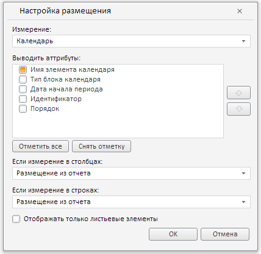

# Пример создания компонента DimViewOptionsDialog

Пример создания компонента DimViewOptionsDialog
-

# Пример создания компонента DimViewOptionsDialog

Для выполнения примера необходимо создать html-страницу и выполнить
 следующие действия:

1. Добавить ссылки на следующие css-файлы: PP.css, PP.Express.css.

Также нужно добавить ссылки на js-файлы: PP.js, PP.Metabase.js, PP.Express.js,
 resources.ru.js.

2. Затем в теге <head> дополнительно задаётся стиль для элементов:

3. Далее в теге <head> необходимо добавить скрипт, который создает
 диалог для настройки размещения измерений:

4. В теге <body> в качестве значения атрибута «onLoad» указываем
 имя функции для загрузки документа экспресс-отчета, внутри тега размещаем
 кнопку, по нажатию на которую будет создан диалог для настройки размещения
 измерений:

<body onselectstart="return false" class="PPNoSelect" onload="Ready()">
    <!-- Кнопка, по нажатию на которую будет создан диалог для настройки размещения измерений -->
    <input type="button" value="Создать диалог" onclick="openDialog()" />
</body>
5. В конце документа вставляем код, устанавливающий стили к вершине
 «document.body», соответствующие операционной системе клиента:

В результате выполнения примера после нажатия кнопки «Создать диалог»
 на html-странице будет размещен компонент [DimViewOptionsDialog](DimViewOptionsDialog.htm):

См. также:

[DimViewOptionsDialog](DimViewOptionsDialog.htm)

		Справочная
		 система на версию 10.9
		 от 18/08/2025,
		 © ООО «ФОРСАЙТ»,
