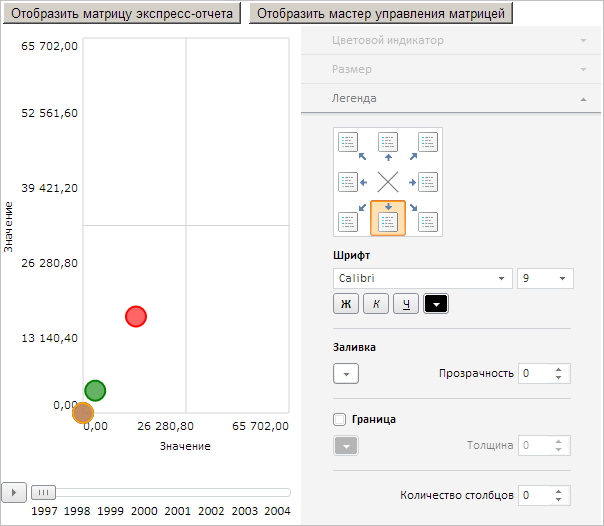

# Пример создания компонента EaxBubbleChart

Пример создания компонента EaxBubbleChart
-

# Пример создания компонента EaxBubbleChart

Для выполнения примера необходимо создать html-страницу и выполнить
 следующие действия:

1. Добавить ссылки на следующие css-файлы: PP.css, PP.Express.css.

Также нужно добавить ссылки на js-файлы: PP.js, PP.Metabase.js, PP.Express.js,
 resources.ru.js, Silverlight.js.

2. Разместить сценарий, который создает пузырьковую диаграмму экспресс-отчета
 и мастер для настройки данной пузырьковой диаграммы:

3. В теге <body> в качестве значения атрибута «onLoad» указать
 имя функции для загрузки документа экспресс-отчета, пузырьковой диаграммы
 и боковой панели:

<body onselectstart="return false" onload="Ready()">
    

        <!-- Кнопка, по нажатию на которую отобразится пузырьковая диаграмма экспресс-отчета -->
        <input type="button" value="Отобразить пузырьковую диаграмму экспресс-отчета" onclick="createEaxBubbleChart()" />
        <!-- Кнопка, по нажатию на которую отобразится мастер управления пузырьковой диаграммой экспресс-отчета -->
        <input type="button" value="Отобразить мастер управления пузырьковой диаграммой" onclick="showBubbleChartMaster()" />
    

    

    

    

    

</body>
4. В конце документа вставляем код, который устанавливает стили к
 вершине «document.body», соответствующие операционной системе клиента:

В результате выполнения примера на html-странице будут размещены две
 кнопки, после нажатия на которые соответственно появятся компоненты PP.Exp.Ui.[EaxBubbleChart](EaxBubbleChart.htm) и PP.Exp.Ui.[BubbleChartMaster](../EaxBubbleChartMaster/EaxBubbleChartMaster.htm):

См. также:

[EaxBubbleChart](EaxBubbleChart.htm)
 | [BubbleChartMaster](../EaxBubbleChartMaster/EaxBubbleChartMaster.htm)

		Справочная
		 система на версию 10.9
		 от 18/08/2025,
		 © ООО «ФОРСАЙТ»,
