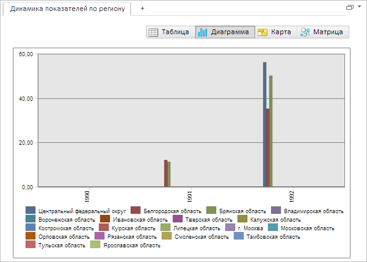

# Пример создания компонента EaxDataBox

Пример создания компонента EaxDataBox
-

# Пример создания компонента EaxDataBox

Для выполнения примера необходимо создать html-страницу и выполнить
 следующие действия:

1. Добавить ссылки на следующие css-файлы: PP.css, PP.Express.css.

Также нужно добавить ссылки на js-файлы: PP.js, PP.Metabase.js, PP.Express.js
 и resources.ru.js.

2. Затем в теге <head> дополнительно задаётся стиль для элементов:

3. Далее в теге <head> необходимо добавить скрипт, создающий контейнер
 для области данных экспресс-отчета [EaxDataBox](EaxDataBox.htm):

4. В теге <body> в качестве значения атрибута «onLoad» указываем
 название функции для создания рабочей области экспресс-отчета, а также
 размещаем блок с идентификатором «ExpressBox»:

<body onselectstart="return false" onload="Ready()">
    

</body>

После выполнения примера на html-странице будет размещён компонент [EaxDataBox](EaxDataBox.htm), имеющий следующий вид:

См. также:

[EaxDataBox](EaxDataBox.htm)

		Справочная
		 система на версию 10.9
		 от 18/08/2025,
		 © ООО «ФОРСАЙТ»,
