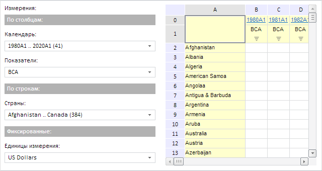

# Пример создания компонента EaxDimBar

Пример создания компонента EaxDimBar
-

# Пример создания компонента EaxDimBar

Для выполнения примера необходимо создать html-страницу и выполнить
 следующие действия:

1. Добавить ссылки на следующие css-файлы: PP.css, PP.Express.css.

Также нужно добавить ссылки на js-файлы: PP.js, PP.Metabase.js, PP.Express.js,
 resources.ru.js.

2. Затем в теге <head> добавим скрипт, который создает панель
 измерений экспресс-отчета и таблицу:

3. В теге <body> в качестве значения атрибута «onLoad» указываем
 название функции для создания рабочей области экспресс-отчета, а также
 размещаем блоки с идентификаторами «dimBar» и «divTable»:

  <body onselectstart="return false" onload="Ready()">
      <table>
          <tbody>
              <tr>
                  <td style='vertical-align: top'>
                      

                      

                  </td>
                  <td>
                      

                      

                  </td>
                  <td>
                      

                      

                  </td>
              </tr>
          </tbody>
      </table>
    </body>
4. В конце документа вставляем код, устанавливающий стили к вершине
 «document.body», соответствующие операционной системе клиента:

После выполнения примера на html-странице будет размещён компоненты
 [EaxDimBar](EaxDimBar.htm) и [EaxGrid](../EaxGrid/EaxGrid.htm):

См. также:

[EaxDimBar](EaxDimBar.htm)

		Справочная
		 система на версию 10.9
		 от 18/08/2025,
		 © ООО «ФОРСАЙТ»,
