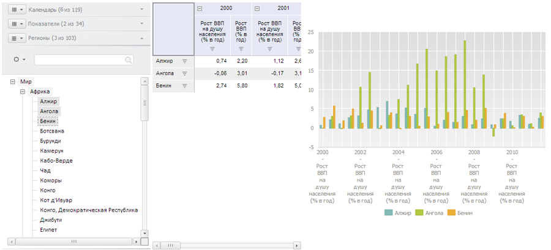

# Пример создания компонента EaxDimBarMaster

Пример создания компонента EaxDimBarMaster
-

# Пример создания компонента EaxDimBarMaster

Для выполнения примера необходимо создать html-страницу и выполнить
 следующие действия:

1. Добавить ссылки на следующие css-файлы: PP.css, PP.Express.css.

Также нужно добавить ссылки на js-файлы: PP.js, PP.Metabase.js, PP.Express.js,
 resources.ru.js.

2. Затем в теге <head> добавим скрипт, который создает мастер
 управления отметкой в измерениях, таблицу и диаграмму экспресс-отчета:

        var dimBarMaster, eaxGrid, metabase, eaxAnalyzer, eaxMbService, eaxChart;
        function Ready() {
            //Установим папку с ресурсами
            PP.resourceManager.setRootResourcesFolder("../resources/");
            // Установим языковые настройки для ресурсов
            PP.setCurrentCulture(PP.Cultures.ru);
            // Создаем соединение с репозиторием
            metabase = new PP.Mb.Metabase({

                ExportUrl: "PPService.axd?action=export",
                ImportUrl: "PPService.axd?action=import",
                PPServiceUrl: "PPService.axd?action=proxy",
                Id: "WAREHOUSE",
                UserCreds: {
                    UserName: "user",
                    Password: "password"
                }
            });
            // Открываем соединение с репозиторием
            metabase.open();

            // Создаем сервис для работы с экспресс-отчётами
            eaxMbService = new PP.Exp.EaxMdService({
                Metabase: metabase
            });
            // Откроем экспресс-отчет с ключом 109
            eaxAnalyzer = eaxMbService.editDocument(109);
            // Создаем мастер, содержащий в себе панели EaxDimBarMasterPanel
            // и таблицу и диаграмму для отображения данных
            dimBarMaster = new PP.Exp.Ui.EaxDimBarMaster({
                ParentNode: "dimBar",
                Width: 300,

                Height: 500,
                Source: eaxAnalyzer, // Определяем источник данных
                ImagePath: "../build/img/", // Путь к папке с пиктограммами
                Service: eaxMbService,
                MetadataChanged: function (sender, args) {
                    console.log(dimBarMaster.getMode());
                }
            });
            eaxGrid = new PP.Exp.Ui.EaxGrid({
                Source: eaxAnalyzer,
                ParentNode: "divTable",
                EditMode: false,

                ImagePath: "../build/img/", // Путь к папке с пиктограммами
                Width: 300,
                Height: 500,
                Service: eaxMbService,
                AutoSendSelection: true
            });
            eaxChart = new PP.Exp.Ui.ChartBox({

                Source: eaxAnalyzer,
                ParentNode: "divChart",
                ImagePath: "../build/img/", // Путь к папке с пиктограммами
                Width: 500,
                Height: 400,
                Service: eaxMbService
            });
            dimBarMaster.setDataView([eaxGrid, eaxChart]);
        }

3. В теге <body> в качестве значения атрибута «onLoad» указываем
 название функции для создания рабочей области экспресс-отчета, а также
 размещаем блоки с идентификаторами «dimBar» и «divTable»:

  <body onselectstart="return false" onload="Ready()">
      <table>
          <tbody>
              <tr>
                  <td style='vertical-align: top'>
                      

                      

                  </td>
                  <td>
                      

                      

                  </td>
                  <td>
                      

                      

                  </td>
              </tr>
          </tbody>
      </table>
    </body>
После выполнения примера на html-странице будут размещены компоненты
 [EaxDimBarMaster](EaxDimBarMaster.htm), [EaxGrid](../EaxGrid/EaxGrid.htm)
 и [ChartBox](../ChartBox/ChartBox.htm):

При обновлении метаданных отчета в консоль браузера будет выводиться
 тип первого представления данных, отметка которого настраивается мастером
 (Grid).

См. также:

[EaxDimBarMaster](EaxDimBarMaster.htm)

		Справочная
		 система на версию 10.9
		 от 18/08/2025,
		 © ООО «ФОРСАЙТ»,
