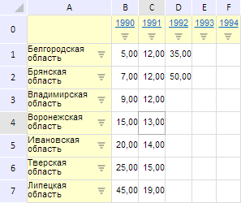

# EaxGrid: DHTML-компонент

EaxGrid: DHTML-компонент
-

**

# EaxGrid

## Описание

Компонент EaxGrid реализует
 контейнер для электронной таблицы в рабочей области экспресс-отчета.

## Комментарии

Компонент EaxGrid реализован
 классом [EaxGrid](../../../Classes/Express/EaxGrid/EaxGrid.htm).

## Пример

Компонент EaxGrid может
 иметь следующий вид:

[Пример совместного размещения EaxPropertyBar
 и EaxGrid](EaxGrid_Example.htm)

## Конструктор

				 Имя конструктора
				 Краткое описание

				 
				 [EaxGrid](dhtmlExpress.chm::/classes/express/eaxgrid/constructor_eaxgrid.htm)
				 Конструктор EaxGrid
				 создает экземпляр класса EaxGrid.

## Свойства

		 Имя свойства
		 Краткое описание

		 
		 [AutoSendSelection](dhtmlExpress.chm::/classes/express/eaxgrid/eaxgrid.autosendselection.htm)
		 Свойство AutoSendSelection
		 определяет, нужно ли после выделения в таблице отправлять изменения
		 сразу на сервер.

		 
		 [Service](dhtmlExpress.chm::/Classes/Express/EaxGrid/EaxGrid.Service.htm)
		 Свойство Service определяет
		 сервис для работы с контейнером таблицы.

## События

		 Имя события
		 Краткое описание

		 
		 [MetadataChanged](dhtmlExpress.chm::/classes/express/eaxgrid/eaxgrid.metadatachanged.htm)
		 Событие MetadataChanged
		 возникает при изменении метаданных для таблицы в рабочей области
		 экспресс-отчета.

## Свойства, унаследованные от класса [EaxGridView](../../../Classes/Express/EaxGridView/EaxGridView.htm)

		 Имя свойства
		 Краткое описание

		 
		 [ContextMenu](dhtmlExpress.chm::/Classes/Express/EaxGridView/EaxGridView.ContextMenu.htm)
		 Свойство ContextMenu
		 устанавливает контекстное меню для таблицы.

		 
		 [DeferSelectionChangedDelay](dhtmlExpress.chm::/Classes/Express/EaxGridView/EaxGridView.DeferSelectionChangedDelay.htm)
		 Свойство DeferSelectionChangedDelay
		 определяет задержку перед изменением выделения таблицы.

		 
		 [DisplayLegend](dhtmlExpress.chm::/Classes/Express/EaxGridView/EaxGridView.DisplayLegend.htm)
		 Свойство DisplayLegend
		 определяет видимость легенды таблицы в рабочей области
		 экспресс-отчета.

		 
		 [EditMode](dhtmlExpress.chm::/Classes/Express/EaxGridView/EaxGridView.EditMode.htm)
		 Свойство EditMode**
		 задает значение флага «Режим
		 редактирования» для таблицы рабочей области экспресс-отчета.

		 
		 [Selection](dhtmlExpress.chm::/Classes/Express/EaxGridView/EaxGridView.Selection.htm)
		 Свойство **Selection**
		 выделяет указанные ячейки таблицы в рабочей области экспресс-отчета.

		 
		 [ShowContextButton](dhtmlExpress.chm::/Classes/Express/EaxGridView/EaxGridView.ShowContextButton.htm)
		 Свойство ShowContextButton
		 управляет видимостью кнопки контекстного меню таблицы в рабочей
		 области экспресс-отчета.

		 
		 [ShowSettingsMenuItem](dhtmlExpress.chm::/Classes/Express/EaxGridView/EaxGridView.ShowSettingsMenuItem.htm)
		 Свойство **ShowSettingsMenuItem**
		 управляет видимостью пункта «Настройка»
		 в контекстном меню таблицы в рабочей области экспресс-отчета.

		 
		 [Source](dhtmlExpress.chm::/Classes/Express/EaxGridView/EaxGridView.Source.htm)
		 Свойство **Source**
		 задает источник данных для таблицы в рабочей области экспресс-отчета.

		 
		 [UseShiftDrillUp](dhtmlExpress.chm::/Classes/Express/EaxGridView/EaxGridView.UseShiftDrillUp.htm)
		 Свойство **UseShiftDrillUp**
		 разрешает поднятие отметки на уровень вверх по иерархии
		 при нажатии на кнопку SHIFT.

		 
		 [VisibleHeaders](dhtmlExpress.chm::/Classes/Express/EaxGridView/EaxGridView.VisibleHeaders.htm)
		 Свойство **VisibleHeaders**
		 задает признак видимости заголовков строк и столбцов таблицы в
		 рабочей области экспресс-отчета.

## Методы, унаследованные от класса [EaxGridView](../../../Classes/Express/EaxGridView/EaxGridView.htm)

		 Имя метода
		 Краткое описание

		 
		 [clearSelection](dhtmlExpress.chm::/classes/express/eaxgridview/eaxgridview.clearselection.htm)
		 Метод **clearSelection**
		 убирает выделение в таблице рабочей области экспресс-отчета.

		 
		 [fireCMenuChanged](dhtmlExpress.chm::/classes/express/eaxgridview/eaxgridview.firecmenuchanged.htm)
		 Метод **fireCMenuChanged**
		 обрабатывает события, возникаемые при выполнении определённых
		 действий с контекстным меню для таблицы рабочей области экспресс-отчета.

		 
		 [firePropertyChanged](dhtmlExpress.chm::/classes/express/eaxgridview/eaxgridview.firepropertychanged.htm)
		 Метод **firePropertyChanged**
		 обрабатывает события, возникаемые при изменении свойств OLAP-куба
		 для таблицы рабочей области экспресс-отчета.

		 
		 [getCellCoords](dhtmlExpress.chm::/classes/express/eaxgridview/eaxgridview.getcellcoords.htm)
		 Метод **getCellCoords**
		 возвращает координаты левой верхней угловой ячейки таблицы в выбранном
		 диапазоне.

		 
		 [getCellType](dhtmlExpress.chm::/classes/express/eaxgridview/eaxgridview.getcelltype.htm)
		 Метод **getCellType**
		 возвращает тип ячейки таблицы по координате.

		 
		 [getChangedData](dhtmlExpress.chm::/classes/express/eaxgridview/eaxgridview.getchangeddata.htm)
		 Метод **getChangedData**
		 возвращает измененные данные в ячейках таблицы рабочей области
		 экспресс-отчета.

		 
		 [getControl](dhtmlExpress.chm::/classes/express/eaxgridview/eaxgridview.getcontrol.htm)
		 Метод **getControl**
		 возвращает родительский элемент управления.

		 
		 [getFocusedCell](dhtmlExpress.chm::/classes/express/eaxgridview/eaxgridview.getfocusedcell.htm)
		 Метод **getFocusedCell**
		 возвращает ячейку таблицы, находящуюся в фокусе.

		 
		 [getInstance](dhtmlExpress.chm::/classes/express/eaxgridview/eaxgridview.getinstance.htm)
		 Метод **getInstance**
		 возвращает экземпляр класса PP.Ui.TabSheet.

		 
		 [getLegend](dhtmlExpress.chm::/classes/express/eaxgridview/eaxgridview.getLegend.htm)
		 Метод getLegend возвращает
		 объект интервальной легенды, тип которой соответствует типу метрики,
		 переданному в качестве параметра.

		 
		 [getRowsCount](dhtmlExpress.chm::/classes/express/eaxgridview/eaxgridview.getrowscount.htm)
		 Метод **getRowsCount**
		 возвращает количество строк в таблице рабочей области экспресс-отчета.

		 
		 [getSelectionType](dhtmlExpress.chm::/classes/express/eaxgridview/eaxgridview.getselectiontype.htm)
		 Метод **getSelectionType**
		 возвращает тип выделенного объекта.

		 
		 [getTableSource](dhtmlExpress.chm::/classes/express/eaxgridview/eaxgridview.gettablesource.htm)
		 Метод **getTableSource**
		 возвращает источник данных таблицы в рабочей области экспресс-отчета.

		 
		 [getTabSheet](dhtmlExpress.chm::/classes/express/eaxgridview/eaxgridview.gettabsheet.htm)
		 Метод **getTabSheet**
		 возвращает лист с таблицей в рабочей области экспресс-отчета.

		 
		 [getTabSheetViewMode](dhtmlExpress.chm::/classes/express/eaxgridview/eaxgridview.gettabsheetviewstate.htm)
		 Метод **getTabSheetViewState**
		 возвращает свойства представления таблицы в JSON-формате.

		 
		 [getViewMode](dhtmlExpress.chm::/classes/express/eaxgridview/eaxgridview.getviewmode.htm)
		 Метод **getViewMode **возвращает
		 значение флага «Режим просмотра»
		 для таблицы рабочей области экспресс-отчета.

		 
		 [isLoaded](dhtmlExpress.chm::/classes/express/eaxgridview/eaxgridview.isloaded.htm)
		 Метод **isLoaded**
		 возвращает признак того, что таблица рабочей области экспресс-отчета
		 загружена.

		 
		 [refresh](dhtmlExpress.chm::/classes/express/eaxgridview/eaxgridview.refresh.htm)
		 Метод **refresh**
		 обновляет указанные элементы таблицы в рабочей области экспресс-отчета.

		 
		 [refreshAll](dhtmlExpress.chm::/classes/express/eaxgridview/eaxgridview.refreshall.htm)
		 Метод **refreshAll**
		 обновляет всё содержимое таблицы рабочей области экспресс-отчета.

		 
		 [setCellValue](dhtmlExpress.chm::/classes/express/eaxgridview/eaxgridview.setcellvalue.htm)
		 Метод **setCellValue** устанавливает
		 значение ячейки таблицы в рабочей области экспресс-отчета.

		 
		 [setScroll](dhtmlExpress.chm::/classes/express/eaxgridview/eaxgridview.setscroll.htm)
		 Метод **setScroll**
		 устанавливает полосы прокрутки для таблицы в рабочей области экспресс-отчета.

		 
		 [undo](dhtmlExpress.chm::/classes/express/eaxgridview/eaxgridview.undo.htm)
		 Метод **undo** осуществляет
		 отмену последней операции, произведённой с таблицей в рабочей
		 области экспресс-отчета.

		 
		 [updateLegendColumn](dhtmlExpress.chm::/classes/express/eaxgridview/eaxgridview.updatelegendcolumn.htm)
		 Метод **updateLegendColumn**
		 обновляет столбец с легендой для диаграммы.

## События, унаследованные от класса [EaxGridView](../../../Classes/Express/EaxGridView/EaxGridView.htm)

		 Имя события
		 Краткое описание

		 
		 [DataChanged](dhtmlExpress.chm::/classes/express/eaxgridview/eaxgridview.datachanged.htm)
		 Событие **DataChanged**
		 наступает после изменения данных в ячейках таблицы рабочей области
		 экспресс-отчета.

		 
		 [ExpanderAction](dhtmlExpress.chm::/classes/express/eaxgridview/eaxgridview.expanderaction.htm)
		 Событие **ExpanderAction**
		 генерируется при разворачивании экспандера в таблице рабочей области
		 экспресс-отчета.

		 
		 [HyperlinkMouseDown](dhtmlExpress.chm::/classes/express/eaxgridview/eaxgridview.hyperlinkmousedown.htm)
		 Событие **HyperlinkMouseDown**
		 наступает при нажатии на гиперссылку в таблице рабочей области
		 экспресс-отчета.

		 
		 [PictureMouseDown](dhtmlExpress.chm::/classes/express/eaxgridview/eaxgridview.picturemousedown.htm)
		 Событие **PictureMouseDown**
		 наступает при нажатии на пиктограмму внутри ячейки таблицы в рабочей
		 области экспресс-отчета.

		 
		 [PropertyChanged](dhtmlExpress.chm::/classes/express/eaxgridview/eaxgridview.propertychanged.htm)
		 Событие **PropertyChanged**
		 наступает после выбора пункта контекстного меню панели свойств
		 экспресс-отчета.

		 
		 [Rendered](dhtmlExpress.chm::/classes/express/eaxgridview/eaxgridview.rendered.htm)
		 Событие **Rendered**
		 генерируется после первой отрисовки таблицы в рабочей области
		 экспресс-отчета.

		 
		 [RequestMetadata](dhtmlExpress.chm::/classes/express/eaxgridview/eaxgridview.requestmetadata.htm)
		 Событие **RequestMetadata**
		 генерируется при отсутствии метаданных в источнике таблицы.

		 
		 [SelectionChanged](dhtmlExpress.chm::/classes/express/eaxgridview/eaxgridview.selectionchanged.htm)
		 Событие **SelectionChanged**
		 наступает после изменения выделения в таблице рабочей области
		 экспресс-отчета.

		 
		 [SelectionChanging](dhtmlExpress.chm::/classes/express/eaxgridview/eaxgridview.selectionchanging.htm)
		 Событие **SelectionChanging**
		 наступает в процессе изменения выделения в таблице рабочей области
		 экспресс-отчета до тех пор, пока кнопка мыши не будет отпущена.

		 
		 [StructureChanged](dhtmlExpress.chm::/classes/express/eaxgridview/eaxgridview.structurechanged.htm)
		 Событие **StructureChanged**
		 генерируется при изменении структуры таблицы: при изменении размеров
		 строк и столбцов.

## Свойства, унаследованные от [PP.Mb.Ui.GridView](dhtmlMetabase.chm::/Classes/Metabase/GridView/GridView.htm)

		 Имя свойства
		 Краткое описание

		 
		 [EditMode](dhtmlMetabase.chm::/Classes/Metabase/GridView/GridView.EditMode.htm)
		 Свойство EditMode
		 определяет признак возможности редактирования таблицы.

		 
		 [Selection](dhtmlMetabase.chm::/Classes/Metabase/GridView/GridView.Selection.htm)
		 Свойство Selection
		 определяет текущее выделение в таблице.

		 
		 [IsAsync](dhtmlMetabase.chm::/Classes/Metabase/GridView/GridView.IsAsync.htm)
		 Свойство IsAsync определяет,
		 используется ли асинхронная загрузка данных таблицы.

		 
		 [Service](dhtmlMetabase.chm::/Classes/Metabase/GridView/GridView.Service.htm)
		 Свойство Service
		 определяет сервис для работы с экспресс-отчетом.

		 
		 [SyncLoadClipboardData](dhtmlMetabase.chm::/Classes/Metabase/GridView/GridView.SyncLoadClipboardData.htm)
		 Свойство SyncLoadClipboardData
		 определяет признак синхронной подгрузки данных, если при копировании
		 есть неподгруженные ячейки.

		 
		 [TableSource](dhtmlMetabase.chm::/Classes/Metabase/GridView/GridView.TableSource.htm)
		 Свойство TableSource
		 определяет источник данных таблицы.

## Методы, унаследованные от [PP.Mb.Ui.GridView](dhtmlMetabase.chm::/Classes/Metabase/GridView/GridView.htm)

		 Имя метода
		 Краткое описание

		 
		 [clearSelection](dhtmlMetabase.chm::/Classes/Metabase/GridView/GridView.clearSelection.htm)
		 Метод clearSelection
		 очищает выделения в таблице.

		 
		 [getChangedData](dhtmlMetabase.chm::/Classes/Metabase/GridView/GridView.getChangedData.htm)
		 Метод getChangedData
		 возвращает измененные данные.

		 
		 [getFocusedCell](dhtmlMetabase.chm::/Classes/Metabase/GridView/GridView.getFocusedCell.htm)
		 Метод getFocusedCell
		 возвращает координаты ячейки таблицы с фокусом.

		 
		 [getInstance](dhtmlMetabase.chm::/Classes/Metabase/GridView/GridView.getInstance.htm)
		 Метод getInstance
		 возвращает экземпляр таблицы.

		 
		 [getRowsCount](dhtmlMetabase.chm::/Classes/Metabase/GridView/GridView.getRowsCount.htm)
		 Метод getRowsCount
		 возвращает количество строк в таблице экспресс-отчета.

		 
		 [getSelectionType](dhtmlMetabase.chm::/Classes/Metabase/GridView/GridView.getSelectionType.htm)
		 Метод getSelectionType
		 возвращает тип текущего выделения в таблице.

		 
		 [getTabSheet](dhtmlMetabase.chm::/Classes/Metabase/GridView/GridView.getTabSheet.htm)
		 Метод getTabSheet
		 возвращает таблицу данных.

		 
		 [setScroll](dhtmlMetabase.chm::/Classes/Metabase/GridView/GridView.setScroll.htm)
		 Метод setScroll определяет
		 признак видимости горизонтально и вертикальной полос прокрутки
		 таблицы.

		 
		 [undo](dhtmlMetabase.chm::/Classes/Metabase/GridView/GridView.undo.htm)
		 Метод **undo** отменяет
		 все изменения в таблице.

## События, унаследованные от [PP.Mb.Ui.GridView](dhtmlMetabase.chm::/Classes/Metabase/GridView/GridView.htm)

		 Имя события
		 Краткое описание

		 
		 [Edited](dhtmlMetabase.chm::/Classes/Metabase/GridView/GridView.Edited.htm)
		 Событие Edited наступает
		 после редактирования данных таблицы.

		 
		 [ExpanderAction](dhtmlMetabase.chm::/Classes/Metabase/GridView/GridView.ExpanderAction.htm)
		 Событие **ExpanderAction**
		 наступает при разворачивании экспандера в таблице.

		 
		 [HyperlinkMouseDown](dhtmlMetabase.chm::/Classes/Metabase/GridView/GridView.HyperlinkMouseDown.htm)
		 Событие **HyperlinkMouseDown**
		 наступает при нажатии на гиперссылку в таблице.

		 
		 [PictureMouseDown](dhtmlMetabase.chm::/Classes/Metabase/GridView/GridView.PictureMouseDown.htm)
		 Событие **PictureMouseDown**
		 наступает при нажатии на картинку внутри ячейки таблицы.

		 
		 [Rendered](dhtmlMetabase.chm::/Classes/Metabase/GridView/GridView.Rendered.htm)
		 Событие **Rendered**
		 наступает после первой отрисовки таблицы.

		 
		 [SelectionChanged](dhtmlMetabase.chm::/Classes/Metabase/GridView/GridView.SelectionChanged.htm)
		 Событие SelectionChanged
		 наступает после изменения выделения в таблице.

		 
		 [SelectionChanging](dhtmlMetabase.chm::/Classes/Metabase/GridView/GridView.SelectionChanging.htm)
		 Событие SelectionChanging
		 наступает при изменении выделения в таблице.

		 
		 [StructureChanged](dhtmlMetabase.chm::/Classes/Metabase/GridView/GridView.StructureChanged.htm)
		 Событие StructureChanged
		 наступает после изменения структуры таблицы.

## Методы, унаследованные от класса [SourceView](dhtmlUi.chm::/Classes/SourceView/SourceView.htm)

		 Имя метода
		 Краткое описание

		 
		 [getSource](dhtmlUi.chm::/Classes/SourceView/SourceView.getSource.htm)
		 Метод getSource
		 возвращает текущий документ экспресс-отчета.

		 
		 [getSrv](dhtmlUi.chm::/Classes/SourceView/SourceView.getSrv.htm)
		 Метод getSrv
		 возвращает сервис, предназначенный для работы с экспресс-отчетом.

		 
		 [loadFile](dhtmlUi.chm::/Classes/SourceView/SourceView.loadFile.htm)
		 Метод loadFile
		 загружает файл с указанным именем.

		 
		 [loadFiles](dhtmlUi.chm::/Classes/SourceView/SourceView.loadFiles.htm)
		 Метод loadFiles
		 загружает файлы скриптов и стилей, основываясь на внутренних параметрах
		 таблицы.

		 
		 [refresh](dhtmlUi.chm::/Classes/SourceView/SourceView.refresh.htm)
		 Метод refresh
		 обновляет указанные элементы таблицы экспресс-отчета.

		 
		 [refreshAll](dhtmlUi.chm::/Classes/SourceView/SourceView.refreshAll.htm)
		 Метод refreshAll
		 обновляет все элементы таблицы экспресс-отчета.

## События, унаследованные от класса [SourceView](dhtmlUi.chm::/Classes/SourceView/SourceView.htm)

		  Имя события
		 Краткое описание

		 
		 [MetadataChanged](dhtmlUi.chm::/Classes/SourceView/SourceView.MetadataChanged.htm)
		 Событие MetadataChanged
		 наступает при изменении настроек экспресс-отчета.

		 
		 [PropertyChanged](dhtmlUi.chm::/Classes/SourceView/SourceView.PropertyChanged.htm)
		 Событие PropertyChanged наступает
		 после изменения значения свойства.

## Свойства, унаследованные от класса [Control](dhtmlUi.chm::/Classes/control/control.htm)

		 Имя свойства
		 Краткое описание

		 
		 [Anchors](dhtmlUi.chm::/Classes/Control/Control.Anchors.htm)
		 Свойство Anchors определяет
		 позицию компонента, размещенного внутри контейнера.

		 
		 [Animation](dhtmlUi.chm::/Classes/Control/Control.Animation.htm)
		 Свойство Animation
		 определяет параметры анимации для компонента.

		 
		 [Bottom](dhtmlUi.chm::/Classes/Control/Control.Bottom.htm)
		 Свойство Bottom определяет
		 отступ снизу при размещении компонента внутри LayoutPanel.

		 
		 [Content](dhtmlUi.chm::/classes\control\control.content.htm)
		 Свойство Content определяет
		 содержимое компонента.

		 
		 [ContextMenu](dhtmlUi.chm::/Classes\Control\Control.ContextMenu.htm)
		 Свойство ContextMenu
		 определяет контекстное меню для компонента.

		 
		 [Data](dhtmlUi.chm::/Classes/Control/Control.Data.htm)
		 Свойство Data предназначено
		 для хранения любых пользовательских данных.

		 
		 [Enabled](dhtmlUi.chm::/classes\control\control.enabled.htm)
		 Свойство Enabled определяет
		 признак доступности компонента для использования.

		 
		 [Height](dhtmlUi.chm::/classes\control\control.height.htm)
		 Свойство Height определяет
		 высоту компонента.

		 
		 [IsRTL](dhtmlUi.chm::/classes\control\control.isrtl.htm)
		 Свойство IsRTL определяет
		 признак расположения элементов компонента по правому краю.

		 
		 [IsVisible](dhtmlUi.chm::/Classes/Control/Control.IsVisible.htm)
		 Свойство IsVisible
		 определяет признак отображения компонента.

		 
		 [Left](dhtmlUi.chm::/Classes/Control/Control.Left.htm)
		 Свойство Left определяет
		 отступ слева при размещении компонента внутри [GridPanel](dhtmlUi.chm::/Components/GridPanel/GridPanel.htm).

		 
		 [Opacity](dhtmlUi.chm::/Classes/Control/Control.Opacity.htm)
		 Свойство Opacity определяет
		 прозрачность компонента.

		 
		 [Parent](dhtmlUi.chm::/Classes/Control/Control.Parent.htm)
		 Свойство Parent определяет
		 родительский компонент элемента управления.

		 
		 [ParentNode](dhtmlUi.chm::/Classes/Control/Control.ParentNode.htm)
		 Свойство ParentNode
		 определяет родительскую DOM-вершину.

		 
		 [ResourceKey](dhtmlUi.chm::/classes\control\control.resourcekey.htm)
		 Свойство ResourceKey
		 определяет ресурсный ключ для компонента.

		 
		 [Right](dhtmlUi.chm::/Classes/Control/Control.Right.htm)
		 Свойство Right определяет
		 отступ справа при размещении компонента внутри LayoutPanel.

		 
		 [Rotate](dhtmlUi.chm::/Classes/Control/Control.Rotate.htm)
		 Свойство Rotate определяет
		 угол поворота компонента.

		 
		 [ShowToolTip](dhtmlUi.chm::/Classes/Control/Control.ShowToolTip.htm)
		 Свойство ShowToolTip
		 определяет признак возможности отображения [всплывающей
		 подсказки](dhtmlUi.chm::/Classes/Control/Control.ToolTip.htm) компонента.

		 
		 [Style](dhtmlUi.chm::/Classes/Control/Control.Style.htm)
		 Свойство Style определяет
		 стиль для компонента.

		 
		 [TabIndex](dhtmlUi.chm::/classes\control\control.tabindex.htm)
		 Свойство TabIndex определяет
		 последовательность перехода элемента управления внутри контейнера.

		 
		 [Tag](dhtmlUi.chm::/Classes/Control/Control.Tag.htm)
		 Свойство Tag определяет
		 JSON-объект, ассоциированный с компонентом.

		 
		 [ToolTip](dhtmlUi.chm::/classes\control\control.tooltip.htm)
		 Свойство ToolTip определяет
		 текст всплывающей подсказки компонента.

		 
		 [Top](dhtmlUi.chm::/Classes/Control/Control.Top.htm)
		 Свойство Top определяет
		 отступ сверху при размещении компонента внутри [GridPanel](dhtmlUi.chm::/Components/GridPanel/GridPanel.htm).

		 
		 [Value](dhtmlUi.chm::/classes\control\control.value.htm)
		 Свойство Value определяет
		 значение компонента.

		 
		 [Width](dhtmlUi.chm::/classes\control\control.width.htm)
		 Свойство Width определяет
		 ширину компонента.

## Методы, унаследованные от класса [Control](dhtmlUi.chm::/Classes/control/control.htm)

		 Имя метода
		 Краткое описание

		 
		 [addClass](dhtmlUi.chm::/classes\control\control.addclass.htm)

		 Метод addClass добавляет
		 CSS-класс к компоненту.

		 
		 [addEventHandler](dhtmlUi.chm::/Classes/Control/Control.addEventHandler.htm)
		 Метод addEventHandler
		 добавляет обработчик события на DOM-вершину.

		 
		 [addStateClass](dhtmlUi.chm::/Classes/Control/Control.addStateClass.htm)

		 Метод addStateClass
		 добавляет CSS-класс к компоненту и удаляет прежний CSS-класс.

		 
		 [addToNode](dhtmlUi.chm::/classes\control\control.addtonode.htm)

		 Метод addToNode добавляет
		 компонент в указанную вершину.

		 
		 [bindEvents](dhtmlUi.chm::/Classes/Control/Control.bindEvents.htm)
		 Метод bindEvents подписывает
		 элемент на все стандартные события.

		 
		 [getAnchorFlags](dhtmlUi.chm::/Classes/Control/Control.getAnchorFlags.htm)

		 Метод getAnchorFlags
		 возвращает JSON-объект с настройками текущей позиции компонента.

		 
		 [getClass](dhtmlUi.chm::/classes\control\control.getclass.htm)

		 Метод getClass возвращает
		 текущие css-классы компонента.

		 
		 [getCssStyle](dhtmlUi.chm::/Classes/Control/Control.getCssStyle.htm)

		 Метод getCssStyle возвращает
		 стили для указанной вершины.

		 
		 [getDomNode](dhtmlUi.chm::/Classes/Control/Control.getDomNode.htm)

		 Метод getDomNode возвращает
		 главную DOM-вершину компонента.

		 
		 [getFocused](dhtmlUi.chm::/Classes/Control/Control.getFocused.htm)

		 Метод getFocused определяет
		 наличие фокуса у компонента.

		 
		 [getIsBinded](dhtmlUi.chm::/Classes/Control/Control.getIsBinded.htm)
		 Метод getIsBinded возвращает
		 признак подписи элемента на события DOM-вершины.

		 
		 [hide](dhtmlUi.chm::/classes\control\control.hide.htm)

		 Метод hide скрывает
		 элемент управления.

		 
		 [hideToolTip](dhtmlUi.chm::/Classes/Control/Control.hideToolTip.htm)

		 Метод hideToolTip очищает
		 таймаут появления подсказки и скрывает её, если она был показана.

		 
		 [refreshStyle](dhtmlUi.chm::/Classes/Control/Control.refreshStyle.htm)
		 Метод refreshStyle
		 обновляет CSS-стили элемента.

		 
		 [removeClass](dhtmlUi.chm::/classes\control\control.removeclass.htm)

		 Метод removeClass удаляет
		 CSS-класс из компонента.

		 
		 [removeEventHandler](dhtmlUi.chm::/Classes/Control/Control.removeEventHandler.htm)
		 Метод removeEventHandler
		 удаляет обработчик события DOM-вершины.

		 
		 [removeFromDOM](dhtmlUi.chm::/classes/control/control.removefromdom.htm)
		 Метод removeFromDOM
		 удаляет вершину из DOM-структуры.

		 
		 [removeStateClasses](dhtmlUi.chm::/Classes/Control/Control.removeStateClasses.htm)

		 Метод removeStateClasses
		 удаляет CSS-классы компонента.

		 
		 [setDraggable](dhtmlUi.chm::/classes\control\control.setdraggable.htm)

		 Метод setDraggable
		 устанавливает возможность перетаскивания компонента на HTML-странице.

		 
		 [setFocus](dhtmlUi.chm::/Classes/Control/Control.setFocus.htm)

		 Метод setFocus устанавливает
		 фокус компонента.

		 
		 [setIsHovered](dhtmlUi.chm::/Classes/Control/Control.setIsHovered.htm)

		 Метод setIsHovered
		 настраивает отображение компонента только при наведении на него
		 курсора.

		 
		 [setSize](dhtmlUi.chm::/classes\control\control.setsize.htm)

		 Метод setSize устанавливает
		 размеры компонента.

		 
		 [show](dhtmlUi.chm::/classes/control/control.show.htm)

		 Метод show отображает
		 элемент управления.

		 
		 [unBindEvents](dhtmlUi.chm::/Classes/Control/Control.unBindEvents.htm)
		 Метод unBindEvents
		 отписывает элемент от всех стандартных событий.

		 
		 [updatePosition](dhtmlUi.chm::/Classes/Control/Control.updatePosition.htm)

		 Метод updatePosition
		 корректирует размер и положение при абсолютном позиционировании
		 на основе текущих параметров.

		 
		 [updateSize](dhtmlUi.chm::/classes\control\control.updatesize.htm)

		 Метод updateSize обновляет
		 размеры компонента подгонке размеров контейнера, в котором находится
		 компонент.

## События, унаследованные от класса [Control](dhtmlUi.chm::/Classes/control/control.htm)

		 Имя события
		 Краткое описание

		 
		 [Drag](dhtmlUi.chm::/classes\control\control.drag.htm)
		 Событие Drag наступает
		 при нажатии и удерживании кнопки мыши.

		 
		 [DragEnd](dhtmlUi.chm::/classes\control\control.dragend.htm)
		 Событие DragEnd наступает
		 при окончании перетаскивания компонента.

		 
		 [DragStart](dhtmlUi.chm::/classes\control\control.dragstart.htm)
		 Событие DragStart наступает,
		 когда начинается перетаскивание компонента.

		 
		 [OnContextMenu](dhtmlUi.chm::/classes\control\control.OnContextMenu.htm)
		 Событие OnContextMenu
		 наступает при вызове контекстного меню компонента.

		 
		 [SizeChanged](dhtmlUi.chm::/Classes/Control/Control.SizeChanged.htm)
		 Событие SizeChanged
		 наступает после изменения размеров компонента.

		 
		 [SizeChanging](dhtmlUi.chm::/Classes/Control/Control.SizeChanging.htm)
		 Событие SizeChanging
		 наступает во время изменения размеров компонента.

## Свойства, унаследованные от класса [Object](dhtmlCommon.chm::/Classes/object/object.htm)

		 Имя свойства
		 Краткое описание

		 
		 [Id](dhtmlCommon.chm::/classes\object\object.id.htm)

		 Свойство Id определяет
		 идентификатор объекта репозитория.

## Методы, унаследованные от класса [Object](dhtmlCommon.chm::/Classes/object/object.htm)

		 Имя метода
		 Краткое описание

		 
		 [clone](dhtmlCommon.chm::/classes\object\object.clone.htm)
		 Метод clone создает
		 копию объекта.

		 
		 [dispose](dhtmlCommon.chm::/classes\object\object.dispose.htm)
		 Метод dispose уничтожает
		 компонент.

		 
		 [getHashCode](dhtmlCommon.chm::/Classes/Object/Object.getHashCode.htm)
		 Метод getHashCode возвращает
		 хеш-код объекта репозитория.

		 
		 [getId](dhtmlCommon.chm::/Classes/Object/Object.Id.htm)
		 Метод getId возвращает
		 идентификатор объекта репозитория.

		 
		 [getSettings](dhtmlCommon.chm::/Classes/Object/Object.getSettings.htm)
		 Метод getSettings возвращает
		 настройки объекта репозитория.

		 
		 [getTypeName](dhtmlCommon.chm::/classes\object\object.gettypename.htm)
		 Метод getTypeName возвращает
		 имя типа объекта без пространства имен, к которому он принадлежит.

		 
		 [isEqual](dhtmlCommon.chm::/Classes/Object/Object.isEqual.htm)
		 Метод isEqual определяет,
		 равен ли заданный объект текущему объекту репозитория.

		 
		 [isLive](dhtmlCommon.chm::/Classes/Object/Object.isLive.htm)
		 Метод isLive определяет
		 действительность объекта репозитория.

		 
		 [removeAllEvents](dhtmlCommon.chm::/Classes/Object/Object.removeAllEvents.htm)
		 Метод removeAllEvents
		 удаляет все обработчики событий объекта по заданному контексту.

		 
		 [setId](dhtmlCommon.chm::/Classes/Object/Object.Id.htm)
		 Метод setId определяет
		 идентификатор объекта репозитория.

		 
		 [setSettings](dhtmlCommon.chm::/Classes/Object/Object.setSettings.htm)
		 Метод setSettings задает
		 настройки объекта репозитория.

		 
		 [defineProps](dhtmlCommon.chm::/Classes/Object/Object.defineProps.htm)
		 Метод defineProps создает
		 методы get и set из массива имен для указанного класса.

		 
		 [keys](dhtmlCommon.chm::/Classes/Object/Object.keys.htm)
		 Метод keys возвращает
		 массив названий методов и свойств для указанного объекта.

См. также:

[DHTML-компоненты](dhtml.chm::/DHTML_components.htm)

		Справочная
		 система на версию 10.9
		 от 18/08/2025,
		 © ООО «ФОРСАЙТ»,
