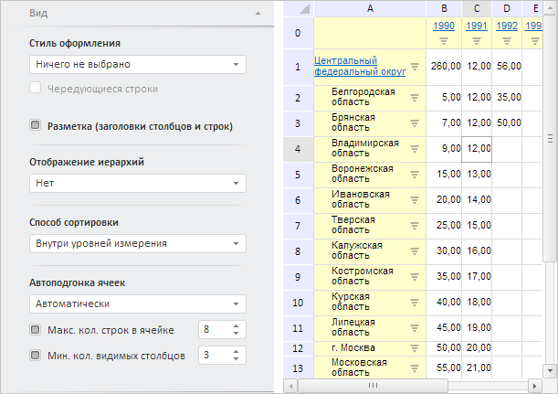

# Пример совместного размещения EaxPropertyBar и EaxGrid

Пример совместного размещения EaxPropertyBar и EaxGrid
-

# Пример совместного размещения EaxPropertyBar и EaxGrid

Для выполнения примера необходимо создать html-страницу и выполнить
 следующие действия:

1. Добавить ссылки на следующие css-файлы: PP.css, PP.Express.css.

Также нужно добавить ссылки на js-файлы: PP.js, PP.Metabase.js, PP.Express.js,
 resources.ru.js.

2. Затем в теге <head> необходимо добавить скрипт, создающий панель
 свойств и контейнер с таблицей [EaxGrid](../../../Classes/Express/EaxGrid/EaxGrid.htm).
 При этом предполагается наличие в репозитории экспресс-отчёта с ключом
 4369:

3. В теге <body> в качестве значения атрибута «onLoad» указать
 имя функции для загрузки документа экспресс-отчёта, пузырьковой диаграммы
 и панели свойств, а также разместить блоки с идентификаторами «propertyBar»
 и «divTable» :

<body onload="Ready()">
    

    

</body>
После выполнения примера на html-странице будут размещены компоненты
 [EaxPropertyBar](../EaxPropertyBar/EaxPropertyBar.htm) и [EaxGrid](EaxGrid.htm):

В процессе их загрузки будут отображаться окна с уведомлениями
 о запросе метаданных и о перерисовке таблицы. На панели свойств будет
 отображена и раскрыта [вкладка
 «Вид](../../../Classes/Express/TableViewPanel/TableViewPanel.htm)».

См. также:

[EaxGrid](EaxGrid.htm)
 | [EaxPropertyBar](../EaxPropertyBar/EaxPropertyBar.htm)

		Справочная
		 система на версию 10.9
		 от 18/08/2025,
		 © ООО «ФОРСАЙТ»,
