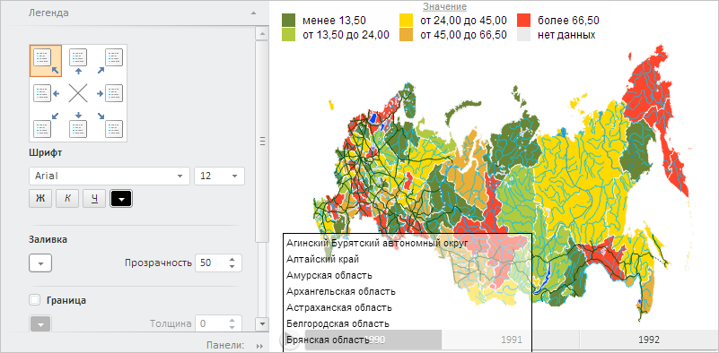

# Пример совместного размещения EaxPropertyBar и EaxMapBox

Пример совместного размещения EaxPropertyBar и EaxMapBox
-

# Пример совместного размещения EaxPropertyBar и EaxMapBox

Для выполнения примера необходимо создать html-страницу и выполнить следующие действия:

1. Добавить ссылку на css-файл PP.css, PP.Express.css.

Также нужно добавить ссылки на js-файлы: PP.js, PP.GraphicsBase.js, PP.Metabase.js, PP.Express.js, Silverlight.js, resources.ru.js.

2. Далее в теге <head> необходимо добавить скрипт, который создаёт боковую панель и контейнер для карты экспресс-отчета:

    PP.ImagePath = "../build/img/"; // Путь к папке с изображениями
    PP.ScriptPath = "../build/"; // Путь к папке со сценариями
    PP.CSSPath = "../build/"; // Путь к папке с файлами стилей
    // Укажем путь к корневой папке, содержащей файлы ресурсов
    PP.resourceManager.setRootResourcesFolder("../resources/");
    // Установим региональные настройки
    PP.setCurrentCulture(PP.Cultures.ru);
    var eaxMdService, map;
    function Ready() {
        waiter = new PP.Ui.Waiter();
        // Создадим соединение с репозиторием
        metabase = new PP.Mb.Metabase({
            PPServiceUrl: "PPService.axd?action=proxy",
            Id: "WAREHOUSE",
            UserCreds: {
                UserName: "user",
                Password: "password"
            },
            StartRequest: function () {
                // При запросе метаданных отобразим компонент типа PP.Ui.Waiter
                waiter.show();
            },
            EndRequest: function () {
                // После запроса метаданных скороем компонент типа PP.Ui.Waiter
                waiter.hide();
            },
            Error: function (sender, args) {
                // В случае ошибки выведем описание данной ошибки
                alert(args.ResponseText);
            }
        });
        // Откроем соединение с репозиторием
        metabase.open();
        // Создадим сервис для работы с экспресс-отчётами
        eaxMdService = new PP.Exp.EaxMdService({
            Metabase: metabase
        });
        // Откроем экспресс-отчет с ключом 4827 на редактирование
        var eaxMdService = new PP.Exp.EaxMdService({
            Metabase: metabase
        });
        eaxAnalyzer = eaxMdService.editDocument(4827);
        // Создадим контейнер для карты экспресс-отчета
        map = new PP.Exp.Ui.EaxMapBox({
            ParentNode: "mapBox",
            Source: eaxAnalyzer, // Источник данных
            Service: eaxMdService,
            Width: 500,
            Height: 400
        });
        // Создадим панель свойств экспресс-отчета
        eaxPropBar = new PP.Exp.Ui.EaxPropertyBar({
            ParentNode: "propertyBar",
            Source: eaxAnalyzer, // Источник данных
            Width: 300,
            Height: 400,
            Service: eaxMdService,
            DataView: map // Панель свойств привяжем к карте
        });
        // Отобразим мастер для настройки карты
        eaxPropBar.showMapMaster();
    };

3. В теге <body> в качестве значения атрибута «onLoad» указываем имя функции для загрузки документа, боковой панели и контейнера с картой экспресс-отчета, внутри тега размещаем блоки для хранения данной панели и контейнера:

<body onload="Ready()">
    

    

</body>

В результате выполнения примера на html-странице будут размещены компоненты [PP.Exp.Ui.EaxPropertyBar](../EaxPropertyBar/EaxPropertyBar.htm) и [PP.Exp.Ui.EaxMapBox](EaxMapBox.htm):

См. также:

[EaxMapBox](EaxMapBox.htm)

		Справочная
		 система на версию 10.9
		 от 18/08/2025,
		 © ООО «ФОРСАЙТ»,
