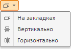

# Пример создания компонента EaxModeSelector

Пример создания компонента EaxModeSelector
-

# Пример создания компонента EaxModeSelector

Для выполнения примера необходимо создать html-страницу и выполнить
 следующие действия:

1. Добавить ссылки на следующие css-файлы: PP.css, PP.Express.css.

Также нужно добавить ссылки на js-файлы: PP.js, PP.Metabase.js, PP.Express.js
 и resources.ru.js.

2. Затем в теге <head> дополнительно задаётся стиль для элементов:

3. Далее в теге <head> необходимо добавить скрипт, создающий кнопку
 для выбора режима отображения представлений данных:

4. В теге <body> в качестве значения атрибута «onLoad» указываем
 название функции для создания кнопки выбора режима отображения представлений
 данных:

<body onselectstart="return false" onload="Ready()">
</body>

5. В конце документа вставляем код, устанавливающий стили к вершине
 «document.body», соответствующие операционной системе клиента:

После выполнения примера на html-странице будет размещена кнопка для
 выбора режима отображения представлений данных:

См. также:

[EaxModeSelector](EaxModeSelector.htm)

		Справочная
		 система на версию 10.9
		 от 18/08/2025,
		 © ООО «ФОРСАЙТ»,
