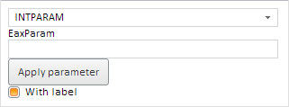

# Пример создания компонента EaxParameterBox

Пример создания компонента EaxParameterBox
-

# Пример создания компонента EaxParameterBox

Для выполнения примера необходимо создать html-страницу и выполнить
 следующие действия:

1. Добавить ссылки на следующие css-файлы: PP.css, PP.Express.css.

Также нужно добавить ссылки на js-файлы: PP.js, PP.Metabase.js, PP.Express.js
 и resources.ru.js.

2. Затем в теге <head> дополнительно задаётся стиль для элементов:

3. Далее в теге <head> необходимо добавить скрипт, создающий контейнер
 для параметра экспресс-отчета [EaxParameterBox](../../../Classes/Express/EaxParameterBox/EaxParameterBox.htm),
 при этом источник данных экспресс-отчета должен содержать параметр INTPARAM:

4. В теге <body> в качестве значения атрибута «onLoad» указываем
 имя функции для создания контейнера для параметра экспресс-отчета, а также
 размещаем блоки с идентификаторами «IdChanger», «EaxParam», «ApplyButton»,
 «LabelCheckBox»:

<body onselectstart="return false" onload="Ready()">
    

    

    

    

</body>

5. В конце документа вставляем код, устанавливающий стили к вершине
 «document.body», соответствующие операционной системе клиента:

После выполнения примера на html-странице будет размещён контейнер для
 параметра экспресс-отчета (компонент [EaxParameterBox](EaxParameterBox.htm)),
 кнопка для сохранения измененных данных параметра (компонент [Button](dhtmlUi.chm::/Classes/Button/Button.htm)),
 элемент управления типа «флажок» для включения и выключения подписи у
 параметра (компонент [CheckBox](dhtmlUi.chm::/Classes/CheckBox/CheckBox.htm))
 и раскрывающийся список для выбора параметра экспресс-отчета (компонент
 [ComboBox](dhtmlUi.chm::/Classes/ComboBox/ComboBox.htm)):

См. также:

[EaxParameterBox](EaxParameterBox.htm)

		Справочная
		 система на версию 10.9
		 от 18/08/2025,
		 © ООО «ФОРСАЙТ»,
