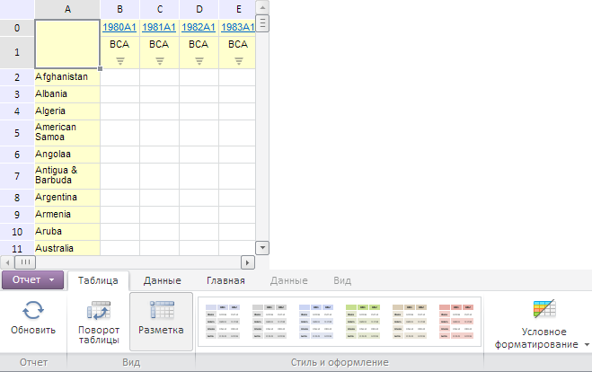

# Пример создания компонента EaxRibbon

Пример создания компонента EaxRibbon
-

# Пример создания компонента EaxRibbon

Для выполнения примера необходимо создать html-страницу и выполнить
 следующие действия:

1. Добавить ссылки на следующие css-файлы: PP.css, PP.Express.css.

Также нужно добавить ссылки на js-файлы: PP.js, PP.Metabase.js, PP.Express.js
 и resources.ru.js.

2. Затем в теге <head> дополнительно задаётся стиль для элементов:

3. Далее в теге <head> необходимо добавить скрипт, создающий контейнер
 для ленты инструментов экспресс-отчета [EaxRibbon](EaxRibbon.htm):

var metabase, eaxAnalyzer, eaxMbService, settings, ribbon, waiter, saveAsD, openD, eaxGrid;
var IMAGE_PATH = "../Img/";

function createView(source, service) {
    // Создаем компонент Waiter
    eaxGrid = new PP.Exp.Ui.EaxGrid({
        ParentNode: document.body,
        Source: eaxAnalyzer,
        Service: eaxMbService,
        Height: 300,
        Width: 300,
        ImagePath: IMAGE_PATH
    });

    var chartCategory, tableCategory, dataCategory, mapCategory, titleCategory;
    // Создаём контейнер для ленты инструментов экспресс-отчета
    ribbon = new PP.Exp.Ui.EaxRibbon({
        Source: eaxAnalyzer, // Устанавливаем источник данных для ленты инструментов
        Enabled: true, // Делаем ленту инструментов доступной
        ImagePath: IMAGE_PATH,
        MainButton: {
            Content: "dataCategory"
        },
        ParentNode: document.body,
        // Задаем вкладки для ленты инструментов
        Categories: [
        // Создаем вкладку «Диаграмма»
        chartCategory = new PP.Exp.Ui.ChartCategory({

            Source: eaxAnalyzer, // Задаем источник данных для вкладки
            Service: eaxMbService, // Задаём сервис
            // Указываем обработчик события DataChanged
            MatadataChanged: function (sender, args) {
                eaxGrid.refresh(args); // Обновим таблицу
            },
            // Указываем обработчик события ControlChanged
            ControlChanged: function (sender, args) {
                eaxGrid.refresh(args); // Обновим таблицу
            },
            // Устанавливаем обработчик для события PropertyChanged
            PropertyChanged: function (sender, args) {
                alert("На вкладке «Диаграмма» изменено свойство");
            },

            // Устанавливаем обработчик для события RequestMetadata
            RequestMetadata: function (sender, args) {
                alert("На вкладке «Диаграмма» выполнен запрос метаданных");
            },
            ImagePath: IMAGE_PATH
        }),
        // Создаем вкладку «Данные»
        dataCategory = new PP.Exp.Ui.DataCategory({
            Source: eaxAnalyzer, // Задаем источник данных для вкладки
            ImagePath: IMAGE_PATH,
            Service: eaxMbService,
            // Указываем обработчик события DataChanged
            MetadataChanged: function (sender, args) {
                eaxGrid.refresh(args); // Обновим таблицу
            },

            // Устанавливаем обработчик для события PropertyChanged
            PropertyChanged: function (sender, args) {
                alert("На вкладке «Данные» изменено свойство");
            },
            // Устанавливаем обработчик для события RequestMetadata
            RequestMetadata: function (sender, args) {
                alert("На вкладке «Данные» выполнен запрос метаданных");
            }
        }),
        // Создаем вкладку «Карта»
        mapCategory = new PP.Exp.Ui.MapCategory({
            Source: eaxAnalyzer, // Задаем источник данных для вкладки
            ImagePath: IMAGE_PATH,
            Service: eaxMbService,

            // Указываем обработчик события DataChanged
            MetadataChanged: function (sender, args) {
                eaxGrid.refresh(args); // Обновим таблицу
            },
            // Устанавливаем обработчик для события PropertyChanged
            PropertyChanged: function (sender, args) {
                alert("На вкладке «Карта» изменено свойство");
            },
            // Устанавливаем обработчик для события RequestMetadata
            RequestMetadata: function (sender, args) {
                alert("На вкладке «Карта» выполнен запрос метаданных");
            }
        }),
        // Создаем вкладку «Таблица»

        tableCategory = new PP.Exp.Ui.TableCategory({
            Source: eaxAnalyzer, // Задаем источник данных для вкладки
            ImagePath: IMAGE_PATH,
            DataView: eaxGrid,
            Service: eaxMbService,
            // Указываем обработчик события DataChanged
            MetadataChanged: function (sender, args) {
                eaxGrid.refresh(args); // Обновим таблицу
            },
            // Устанавливаем обработчик для события PropertyChanged
            PropertyChanged: function (sender, args) {
                alert("На вкладке «Таблица» изменено свойство");
            },
            // Устанавливаем обработчик для события RequestMetadata
            RequestMetadata: function (sender, args) {
                alert("На вкладке «Таблица» выполнен запрос метаданных");
            }

        }),
        // Создаем вкладку «Заголовок»
        titleCategory = new PP.Exp.Ui.TitleCategory({
            Source: eaxAnalyzer, // Задаем источник данных для вкладки
            ImagePath: IMAGE_PATH,
            Service: eaxMbService,
            // Указываем обработчик события DataChanged
            MetadataChanged: function (sender, args) {
                eaxGrid.refresh(args); // Обновим таблицу
            },
            // Устанавливаем обработчик для события PropertyChanged
            PropertyChanged: function (sender, args) {
                alert("На вкладке «Заголовок» изменено свойство");
            },

            // Устанавливаем обработчик для события RequestMetadata
            RequestMetadata: function (sender, args) {
                alert("На вкладке «Заголовок» выполнен запрос метаданных");
            }
        })],
        Width: 600,
        Height: 600,
        // Устанавливаем обработчик для события Collapsed
        Collapsed: function (sender, args) {
            alert("Сворачивание");
        },
        // Устанавливаем обработчик для события Expanded
        Expanded: function (sender, args) {

            alert("Раскрытие");
        },
        // Устанавливаем обработчик для события Printing
        Printing: function (sender, args) {
            alert("Печать");
        },
        // Устанавливаем обработчик для события SaveAs
        SaveAs: function (sender, args) {
            alert("Выбран пункт меню «Сохранить как...»");
        },
        // Устанавливаем обработчик для события DataChanged
        DataChanged: function (sender, args) {

            // Обновим таблицу
            eaxGrid.refresh(args);
        },
        // Устанавливаем обработчик события DiscussMenuOpened
        DiscussMenuOpened: function (sender, args) {
            alert("Открыто меню «Поделиться»");
        },
        // Устанавливаем обработчик события Discuss
        Discuss: function (sender, args) {

            alert("Выбран пункт меню «Поделитьсяt»");
        },
        // Устанавливаем обработчик для события PropertyChanged
        PropertyChanged: function (sender, args) {
            alert("Свойство изменено");
        },
        // Устанавливаем обработчик для события NewReport
        NewReport: function (sender, args) {
            alert("Выбран пункт меню «Новый отчёт»");
        },
        // Устанавливаем обработчик для события Exported
        Exported: function (sender, args) {

            alert("Выбран пункт меню «Экспорт»");
        },
        // Устанавливаем обработчик для события Closed
        Closed: function (sender, args) {
            alert("Выбран пункт меню «Закрыть»");
        },
        // Устанавливаем обработчик для события Exited
        Exited: function (sender, args) {
            alert("Выбран пункт меню «Выход»");
        },
        // Устанавливаем обработчик для события Opened
        Opened: function (sender, args) {

            alert("Выбран пункт меню «Открыть»");
        },
        // Устанавливаем обработчик для события Saved
        Saved: function (sender, args) {
            alert("Выбран пункт меню «Сохранить»");
        },
        // Устанавливаем обработчик для события RequestMetadata
        RequestMetadata: function (sender, args) {
            alert("Запрос метаданных");
        },

        // Устанавливаем обработчик для события CreatedCopy
        CreatedCopy: function (sender, args) {
            console.log("Выбран пункт меню «Сохранить как...»");
        },
        // Устанавливаем обработчик для события CreatedReport
        CreatedReport: function (sender, args) {
            console.log("Выбран пункт меню «Сохранить»");
        }
    });
    // Обновляем все элементы ленты инструментов
    ribbon.refreshAll();
    // Каждой вкладке задаем представление таблицы

    chartCategory.bindView(eaxGrid);
    mapCategory.bindView(eaxGrid);
    titleCategory.bindView(eaxGrid);
    tableCategory.bindView(eaxGrid);
    dataCategory.bindView(eaxGrid);
}

function Ready() {
    waiter = new PP.Ui.Waiter();
    // Создаём соединение с репозиторием
    metabase = new PP.Mb.Metabase({

        ExportUrl: "PPService.axd?action=export",
        ImportUrl: "PPService.axd?action=import",
        PPServiceUrl: "PPService.axd?action=proxy",
        Id: "WAREHOUSE",
        UserCreds: {
            UserName: "user",
            Password: "password" },
        StartRequest: function () {
            // Покажем компонент Waiter
            waiter.show();
        },
        EndRequest: function () {
            // Скроем компонент Waiter
            waiter.hide();
        },

        Error: function (sender, args) {
            // Выводим сообщение об ошибке
            alert(args.ResponseText);
        }
    });
    // Открываем соединение с репозиторием
    metabase.open();
    // Создаём сервис
    eaxMbService = new PP.Exp.EaxMdService({ Metabase: metabase });
    // Открываем документ с ключом 109
    eaxAnalyzer = eaxMbService.edit(109);

    //Создаём представление
    createView(eaxAnalyzer, eaxMbService);
};

window.onerror = function () {
    // В случае ошибки скрываем компонент Waiter
    if (waiter)
        waiter.hide();
};

4. Тег <body> и его содержимое должны выглядеть следующим образом:

<body onselectstart="return false" class="PPNoSelect" onload="Ready()">
</body>
После выполнения примера на html-странице будут размещены компоненты
 [EaxGrid](../EaxGrid/EaxGrid.htm) и [EaxRibbon](EaxRibbon.htm):

См. также:

[EaxRibbon](EaxRibbon.htm)

		Справочная
		 система на версию 10.9
		 от 18/08/2025,
		 © ООО «ФОРСАЙТ»,
