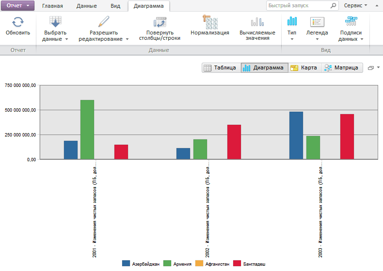

# Пример совместного использования компонентов EaxRibbon и EaxDataBox

Пример совместного использования компонентов EaxRibbon и EaxDataBox
-

# Пример совместного использования компонентов EaxRibbon и EaxDataBox

Для выполнения примера создайте html-страницу и выполните следующие
 действия:

1. В теге HEAD добавьте ссылки на следующие js и css-файлы:

	- PP.css;

	- PP.Express.css;

	- PP.js;

	- PP.Metabase.js;

	- PP.Express.js;

	- resources.ru.js.

2. В теге SCRIPT добавьте код для создания компонентов [EaxRibbon](EaxRibbon.htm)
 и [EaxDataBox](../EaxDataBox/EaxDataBox.htm):

    var eaxData;
    var idTime;
    onReady = function () {
        var IMAGE_PATH = "../build/img/";//путь к папке с картинками
        PP.resourceManager.setRootResourcesFolder("../resources/");//путь к папке с ресурсами
        PP.setCurrentCulture(PP.Cultures.ru);//выбор языковых настроек
        var eaxAnalyzer, eaxMbService;
        //создаем компонент Waiter для ожидания соединения с метабазой
        waiter = new PP.Ui.Waiter();
        //Создаём экземпляр метабазы
        metabase = new PP.Mb.Metabase({

            Id: "WAREHOUSE",
            UserCreds: { UserName: "user", Password: "password" },
            StartRequest: function () {
                waiter.show();
            },
            EndRequest: function () {
                waiter.hide();
            },
            Error: function (sender, args) {
                alert(args.ResponseText);
            }
        });
        //Открываем метабазу
        metabase.open();
        //Создаём сервис для работы с экспресс-отчетами
        eaxMbService = new PP.Exp.EaxMdService({ Metabase: metabase });

        //Открываем экспресс-отчет с ключом 935529 на редактирование
        eaxAnalyzer = eaxMbService.edit(935529);
        //Создаём область данных
       eaxData = new PP.Exp.Ui.EaxDataBox({
            ParentNode: "Eax",
            Source: eaxAnalyzer, //источник данных
            Service: eaxMbService, //сервис, через который открыт источник данных
            Width: "100%",
            Height: "100%",
            ImagePath: IMAGE_PATH,
            DataChanged: function (sender, args) {
                eaxData.refresh(args);
                rb.refresh(args);
            }

        });
        //Создаём ленту
        rb = new PP.Exp.Ui.EaxRibbon({
            ParentNode: "Ribbon",
            Source: eaxAnalyzer,
            Service: eaxMbService,
            ImagePath: IMAGE_PATH,
            ChartDataView: eaxData.getChartView(),//Указываем представления карты и диаграммы для работы настроек на ленте
            MapDataView: eaxData.getMapView(),
            DataChanged: function (sender, args) {
                eaxData.refresh(args);
            }

        });
        window.onresize();
    }
    // Функция для изменения размеров контейнера EaxDataBox при изменении размеров страницы
    window.onresize = function ()
    {
        if (idTime)
            clearTimeout(idTime);
        idTime = setTimeout(function () {
            if (eaxData)
                eaxData.setSize(document.body.offsetWidth, document.body.offsetHeight - rb.getHeight());

            idTime = null;
        }, 100);
    };

3. В теге BODY разместите созданные компоненты и укажите функцию, которая
 будет выполняться при загрузке страницы:

<body onselectstart="return false"
 class="PPNoSelect" onload="onReady()">

    

    

    

    

</body>

После выполнения примера на странице будут размещены компоненты [EaxRibbon](EaxRibbon.htm)
 и [EaxDataBox](../EaxDataBox/EaxDataBox.htm):

При изменении настроек диаграммы, карты, таблицы и пузырьковой диаграммы
 из ленты инструментов установленные настройки будут применяться к диаграмме.
 При изменении размеров окна браузера будут меняться размеры размещенных
 компонентов.

См. также:

[EaxRibbon](EaxRibbon.htm)
 | [Пример создания компонента EaxRibbon](EaxRibbon_Example.htm)

		Справочная
		 система на версию 10.9
		 от 18/08/2025,
		 © ООО «ФОРСАЙТ»,
