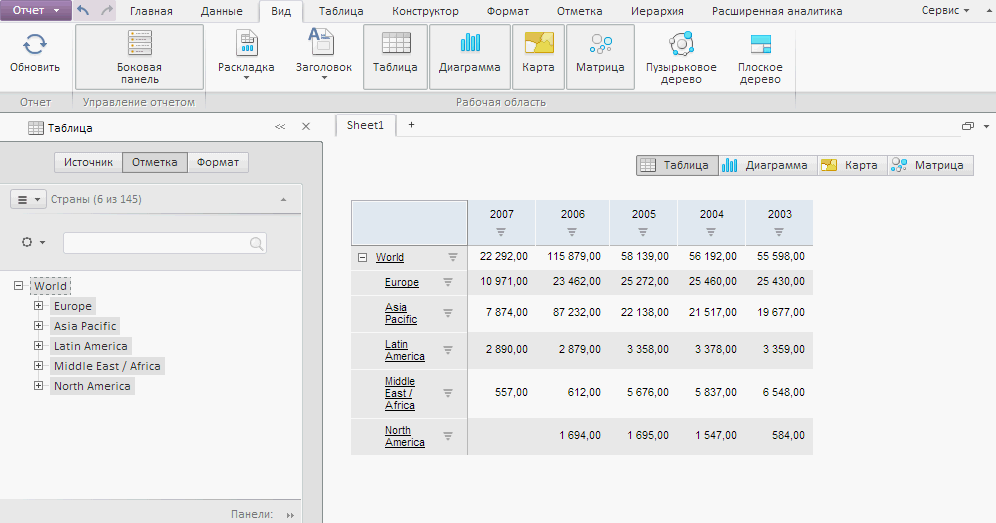

# Пример создания компонента ExpressBox

Пример создания компонента ExpressBox
-

# Пример создания компонента ExpressBox

Для выполнения примера необходимо создать html-страницу и выполнить
 следующие действия:

1. Добавить ссылки на следующие на файлы: PP.js, PP.Metabase.js, PP.App.js,
 PP.Express.js, resources.ru.js.

2. Добавьте [код
 для динамического подключения стилей](dhtml.chm::/DHTML_components_layout.htm#add_styles) PP.css, PP.App.css,
 PP.Express.css, PP.Metabase.css.

3. Затем в теге <head> дополнительно задаётся стиль для элементов:

4. Далее в теге <head> необходимо добавить скрипт, создающий контейнер
 для экспресс-отчета [ExpressBox](ExpressBox.htm):

Примечание. Компонент ReportBox с подписками
 на события главного меню «Отчёт» реализуется при помощи компонента [PP.App.init](dhtmlApp.chm::/Classes/App/PP.App.init.htm)
 или конструктора [PP.Application.EaxModuleObject](dhtmlApp.chm::/Classes/Application/EaxModuleObject/Constructor_EaxModuleObject.htm).

Замените в скрипте строки создания компонента ExpressBox для использования
 PP.App.init:

PP.App.init(PP.App.ModuleType.Olap, { Metabase: {IsMbOpened: true}, Module: {
    Source : eaxAnalyzer,
    Service : eaxMdService,
    },
});
Для использования PP.App.PrxModuleObject:

var moduleObject = new PP.App.EaxModuleObject({ "Source": eaxAnalyzer, "Service": eaxMdService, "ParentNode": document.body });
expressBox = moduleObject.getReportBox();
5. В теге <body> в качестве значения атрибута «onLoad» указываем
 название функции для создания контейнера экспресс-отчета:

<body onload="Ready()">
</body>

После выполнения примера на html-странице будет размещён компонент [ExpressBox](ExpressBox.htm), имеющий следующий вид:

См. также:

[ExpressBox](ExpressBox.htm)

		Справочная
		 система на версию 10.9
		 от 18/08/2025,
		 © ООО «ФОРСАЙТ»,
