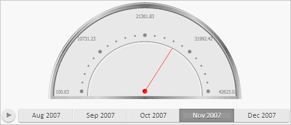

# Пример создания компонента GaugeBox

Пример создания компонента GaugeBox
-

# Пример создания компонента GaugeBox

Для выполнения примера необходимо создать html-страницу и выполнить
 следующие действия:

1. Добавить ссылки на следующие css-файлы: PP.css.

Также нужно добавить ссылки на js-файлы: PP.js, PP.Metabase.js, PP.Express.js,
 PP.GraphicsBase.js, PP.Charts.js, PP.GaugeMaster.js, PP.Util.js.

2. Дополнительно указать стиль для элементов:

3. Добавить сценарий, который создает контейнер со [спидометром](dhtmlGauge.chm::/Classes/Speedometer/Speedometer/Speedometer.htm).
 При этом предполагается наличие в репозитории экспресс-отчёта с ключом
 4397:

4. В теге <body> в качестве значения атрибута «onLoad» укажем
 имя функции для загрузки контейнера со спидометром:

<body onload="Ready()">
</body>
После выполнения примера на html-странице был размещен компонент [GaugeBox](GaugeBox.htm) со [спидометром](GaugeBox.htm):

При этом в консоли браузера было выведено уведомление о запросе метаданных.

См. также:

[GaugeBox](GaugeBox.htm)

		Справочная
		 система на версию 10.9
		 от 18/08/2025,
		 © ООО «ФОРСАЙТ»,
