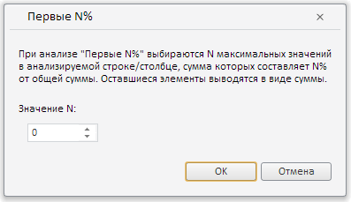

# Пример создания компонента ParetoDialog

Пример создания компонента ParetoDialog
-

# Пример создания компонента ParetoDialog

Для выполнения примера необходимо создать html-страницу и выполнить
 следующие действия:

1. Добавить ссылки на следующие css-файлы: PP.css, PP.Express.css.

Также нужно добавить ссылки на js-файлы: PP.js, PP.Metabase.js, PP.Express.js,
 resources.ru.js.

2. Затем в теге <head> дополнительно задаётся стиль для элементов:

3. Далее в теге <head> необходимо добавить скрипт, который создает
 диалог для настройки распределения данных по Парето:

4. В теге <body> в качестве значения атрибута «onLoad» указываем
 имя функции для установки локали для ресурсов и задания пути к корневой
 папке, в которой они располагаются. Внутри тега размещаем кнопку, по нажатию
 на которую будет создан диалог для настройки распределения данных по Парето:

<body onselectstart="return false" class="PPNoSelect" onload="Ready()">
    <!-- Кнопка, по нажатию на которую будет создан диалог настройки «Первые N%»
         распределения по Парето -->
    <input type="button" value="Отобразить paretoDialog" onclick="openDial()" />
</body>
5. В конце документа вставляем код, устанавливающий стили к вершине
 «document.body», соответствующие операционной системе клиента:

В результате выполнения примера после нажатия кнопки «Отобразить paretoDialog»
 на html-странице будет размещен компонент [ParetoDialog](ParetoDialog.htm):

См. также:

[ParetoDialog](ParetoDialog.htm)

		Справочная
		 система на версию 10.9
		 от 18/08/2025,
		 © ООО «ФОРСАЙТ»,
