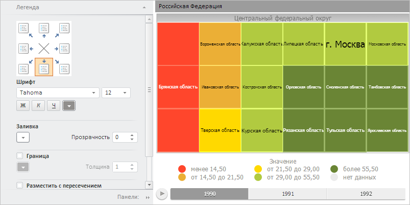

# Пример создания компонента TreeMapBox

Пример создания компонента TreeMapBox
-

# Пример создания компонента TreeMapBox

Для выполнения примера необходимо создать html-страницу и выполнить
 следующие действия:

1. Добавить ссылки на следующие css-файлы: PP.css, PP.Express.css.

Также нужно добавить ссылки на js-файлы: PP.js, PP.Metabase.js, PP.Express.js,
 resources.ru.js.

2. Далее в теге <head> необходимо добавить сценарий, который создает
 контейнер с [плоским
 деревом](dhtmlBubbleTree.chm::/Classes/TreeMap/TreeMap.htm) и [мастер
 для его настройки](dhtmlBubbleTree.chm::/Classes/TreeMapMaster/TreeMapMaster.htm). При этом предполагается наличие
 в репозитории экспресс-отчёта с ключом 3539:

3. В теге <body> требуется разместить два блока с идентификаторами
 «PropertyBar» и «TreeMapBox» для хранения контейнера с плоским деревом
 и мастером для его настройки соответственно:

<body onload="Ready()">
    <table>
        <tr>
            <td>

</td>
            <td>

</td>
         </tr>
    </table>
</body>
После выполнения примера на html-странице были размещены компоненты
 [TreeMapBox](TreeMapBox.htm) и [TreeMapMaster](dhtmlBubbleTree.chm::/Classes/TreeMapMaster/TreeMapMaster.htm):

См. также:

[TreeMapBox](TreeMapBox.htm)

		Справочная
		 система на версию 10.9
		 от 18/08/2025,
		 © ООО «ФОРСАЙТ»,
