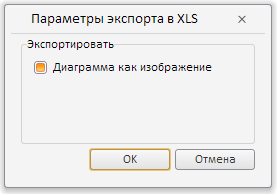

# Пример создания компонента XlsExportDialog

Пример создания компонента XlsExportDialog
-

# Пример создания компонента XlsExportDialog

Для выполнения примера необходимо создать html-страницу и выполнить
 следующие действия:

1. Добавить ссылки на следующие css-файлы: PP.css, PP.Express.css.

Также нужно добавить ссылки на js-файлы: PP.js, PP.Metabase.js, PP.Express.js,
 resources.ru.js.

2. Затем в теге <head> дополнительно задаётся стиль для элементов:

3. Далее в теге <head> необходимо добавить скрипт, который создает
 диалог «Параметры экспорта в XLS»:

4. В теге <body> в качестве значения атрибута «onLoad» указываем
 имя функции для загрузки документа экспресс-отчета, внутри тега размещаем
 кнопку, по нажатию на которую будет создан диалог «Параметры экспорта
 в XLS»:

<body onselectstart="return false" class="PPNoSelect" onload="Ready()">
<!-- Кнопка, по нажатию на которую будет создан диалог «Параметры экспорта в XLS» -->
<input type="button" value="Вызвать диалог экспорта" onclick="showExpDialog()" />
</body>

5. В конце документа вставляем код, устанавливающий стили к вершине
 «document.body», соответствующие операционной системе клиента:

В результате выполнения примера после нажатия кнопки «Вызвать диалог
 экспорта» на html-странице будет размещен компонент [XlsExportDialog](XlsExportDialog.htm):

После нажатия на кнопку OK будет показан диалог сохранения экспортируемого
 в XLS файла.

См. также:

[XlsExportDialog](XlsExportDialog.htm)

		Справочная
		 система на версию 10.9
		 от 18/08/2025,
		 © ООО «ФОРСАЙТ»,
