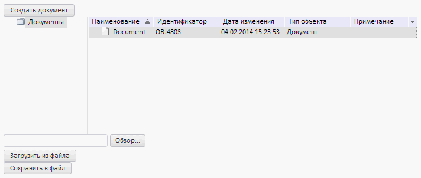

# Создание документа

Создание документа
-

# Создание документа

В данной статье рассмотрен пример создания в репозитории объекта типа
 «[Документ](UiNavObj.chm::/UiNavObj_document.htm)»,
 загрузки его источника и выгрузки созданного документа во внешний файл.

Для выполнения примера в теге HEAD добавьте ссылки на следующие файлы:

	- PP.css;

	- PP.js;

	- PP.Metabase.js;

	- PP.Metabase.css;

	- resources.ru.js.

Предполагается наличие в репозитории папки с ключом 4653, в которой
 будет создан документ.

В теге BODY добавьте код для размещения компонентов на странице:

<body>
   

   

   

   

   

</body>
В теге SCRIPT добавьте код для создания компонента [NavigatorBox](dhtmlMetabase.chm::/Classes/Metabase/NavigatorBox/NavigatorBox.htm),
 кнопки для создания объекта типа «Документ», компонента для выбора
 источника документа, кнопок для загрузки источника и выгрузки документа
 во внешний файл:

После выполнения примера на странице будет размещен компонент [NavigatorBox](dhtmlMetabase.chm::/Classes/Metabase/NavigatorBox/NavigatorBox.htm)
 и кнопка «Создать документ». При нажатии на кнопку в корневую папку будет
 добавлен документ, и на странице будут размещены компонент для выбора
 источника документ и кнопки «Загрузить из файла» и «Сохранить в файл»:

Нажмите на кнопку «Обзор» и в открывшемся диалоге выберите источник
 для документа. Чтобы загрузить источник в документ нажмите на кнопку «Загрузить
 из файла». Чтобы сохранить загруженный файл во внешний документ, нажмите
 на кнопку «Сохранить в файл».

Чтобы удалить документ из репозитория, используйте метод [NavigatorBox.deleteObjects](dhtmlMetabase.chm::/Classes/Metabase/NavigatorBox/NavigatorBox.deleteObjects.htm).

См. также:

[Вопросы
 и ответы](../dhtml_FAQ.htm) | [NavigatorBox](dhtmlMetabase.chm::/Classes/Metabase/NavigatorBox/NavigatorBox.htm)
 | [FileUpload](dhtmlUi.chm::/Classes/FileUpLoad/FileUpload.htm)

		Справочная
		 система на версию 10.9
		 от 18/08/2025,
		 © ООО «ФОРСАЙТ»,
