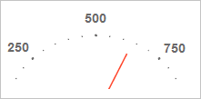

# Конструктор DropShadow

Конструктор DropShadow
-

# Конструктор DropShadow

## Синтаксис

PP.Ui.DropShadow (settings: Object);

## Параметры

settings. JSON-объект со значениями
 свойств класса.

## Описание

Конструктор DropShadow создает
 экземпляр класса DropShadow.

## Пример

Для выполнения примера необходимо наличие на html-странице компонента
 [GaugeBox](dhtmlExpress.chm::/Components/Express/GaugeBox/GaugeBox.htm)
 с наименованием «gaugeBox» (см. «[Пример
 создания компонента GaugeBox](dhtmlExpress.chm::/Components/Express/GaugeBox/GaugeBox_Example.htm)»). Создадим и отобразим тень третьей
 шкалы спидометра со смещением, равным 5 пикселям, увеличим её в 1,5 раза
 и установим для неё новый цвет и толщину пера:

var createShadow = function(element, offset) {
    var dropShadow = new PP.Ui.DropShadow({
        Offset: offset // Смещение
    });
    // Отрисовываем тень для визуального элемента спидометра
    dropShadow.render(element);
    return dropShadow;
};
var applyStrokeSettings = function(shadow, color, width) {
    // Устанавливаем цвет пера
    dropShadow.setAttr({
        "stroke": color
    });
    // Устанавливаем толщину пера
    if (dropShadow.getShadowElement()) {
        dropShadow.getShadowElement().setAttribute("stroke-width", width);
    };
};
var showOndlyShadow = function(shadow, parentNode, scale) {
    // Преобразуем тень шкалы спидометра из формата SVG в формат канвы
    var renderer = new PP.Ui.CanvasSVGRenderer({
        ScaleX: scale,
        ScaleY: scale
    });
    parentNode.appendChild(renderer.render(shadow.getShadowElement()));
    // Удаляем контейнер для спидометра
    gaugeBox.dispose();
}
if (gaugeBox && gaugeBox.getInstance() && gaugeBox.getInstance().getScales()[2]) {
    // Создаём тень для третьей шкалы спидометра
    var dropShadow = createShadow(gaugeBox.getInstance().getScales()[2].getDomNode(), new PP.Point(5, 5));
    // Применяем настройки пера
    applyStrokeSettings(dropShadow, (new PP.Color(0, 0, 0)).toString(), 0.5);
    // Отображаем только тень для третьей шкалы спидометра
    showOndlyShadow(dropShadow, document.body, 1.5);
}
В результате выполнения примера была создана и отображена тень третьей
 шкалы спидометра со смещением, равным 5 пикселям. Данная шкала увеличена
 в 1,5 раза, для неё установлены новый цвет и толщина пера:

См. также:

[DropShadow](DropShadow.htm)

		Справочная
		 система на версию 10.9
		 от 18/08/2025,
		 © ООО «ФОРСАЙТ»,
