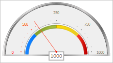

# GaugeArrowBase.animate

GaugeArrowBase.animate
-

# GaugeArrowBase.animate

## Синтаксис

animate(step: Number);

## Параметры

step. Шаг анимации.

## Описание

Метод animate переводит параметры стрелки к указанному шагу анимации.

## Пример

Для выполнения примера предполагается наличие на странице компонента [Speedometer](../../../Components/Speedometer/Speedometer.htm) с наименованием «speedometer» (см. «[Пример создания спидометра с мастером](../../../Components/Speedometer/speedometer_wirh_master.htm)»).

Получим указатель шкалы по имени и изменим его параметры. Перерисуем шкалы спидометра. Установим значение следующего шага анимации для полученного указателя и перейдем к нему. Перерисуем спидометр:

// Получим шкалу спидометра
var scale = speedometer.getScales()[3];
// Получим указатель шкалы по имени
var arrow = scale.getArrowByName("Arrow1")[0];
// Запретим использование прозрачности
arrow.setOpacityEnabled(false);
// Установим длину указателя
arrow.setRadius(0.8);
// Установим значение указателя
arrow.setValue(0);
// Перерисуем шкалы спидометра
speedometer.redrawScales();
// Установим значение следующего шага анимации
arrow.setAnimationValues(300);
// Перейдем к указанному шагу анимации
arrow.animate(1);
// Перерисуем спидометр
speedometer.redraw();

В результате выполнения примера полученный указатель был переведен к шагу анимации с указанными параметрами:

См. также:

[GaugeArrowBase](GaugeArrowBase.htm)

		Справочная
		 система на версию 10.9
		 от 18/08/2025,
		 © ООО «ФОРСАЙТ»,
