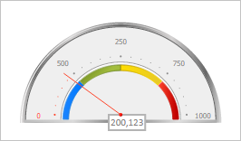

# GaugeCenterLabel.Arrow

GaugeCenterLabel.Arrow
-

# GaugeCenterLabel.Arrow

## Синтаксис

Arrow: [PP.Ui.GaugeArrowBase](../GaugeArrowBase/GaugeArrowBase.htm);

## Описание

Свойство Arrow определяет
 стрелку шкалы для центральной текстовой метки.

## Комментарии

Значение свойства устанавливается из JSON и с помощью метода setArrow,
 а возвращается с помощью метода getArrow.

## Пример

Для выполнения примера необходимо наличие на странице компонента [Speedometer](../../../Components/Speedometer/Speedometer.htm)
 с идентификатором «speedometer» (см. «[Пример
 создания спидометра с мастером](../../../Components/Speedometer/speedometer_wirh_master.htm)»). Установим для центральной текстовой
 метки спидометра стрелку шкалы, формат вывода значений в подписи и признак
 автоматического расчета размеров:

// Удаляем мастер для настройки
master.setDataView(null);
master.dispose();
// Получаем центральную метку спидометра
var label = speedometer.getCenterLabel();
// Получаем шкалу спидометра
var scale = speedometer.getScales()[3];
// Получаем стрелку шкалы по имени
var arrow = scale.getArrowByName("Arrow1")[0];
// Запрещаем использование прозрачности
arrow.setOpacityEnabled(false);
// Устанавливаем длину стрелки
arrow.setRadius(0.8);
// Устанавливаем значение стрелки
arrow.setValue(200.123);
// Устанавливаем стрелку шкалы для центральной метки
label.setArrow(arrow);
// Устанавливаем формат вывода значений в подписи метки
label.setMaskLabel("{0:0.000}");
// Устанавливаем признак автоматического расчета размеров центральной метки с вызовом перерисовки объекта
label.setAutoSize(true, true);
В результате выполнения примера для центральной текстовой метки была
 установлена стрелка в виде линии, а также установлено значение 200.123,
 которое было отображено в заданном формате. Размеры текстовой метки были
 пересчитаны в соответствии с размерами нового значения подписи метки:

См. также:

[GaugeCenterLabel](GaugeCenterLabel.htm)

		Справочная
		 система на версию 10.9
		 от 18/08/2025,
		 © ООО «ФОРСАЙТ»,
