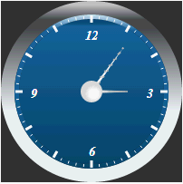

# GaugeObject.BorderStyle

GaugeObject.BorderStyle
-

# GaugeObject.BorderStyle

## Синтаксис

BorderStyle: [PP.BorderStyle](dhtmlCommon.chm::/Enums/BorderStyle.htm);

## Описание

Свойство BorderStyle определяет
 стиль отрисовки границ элемента.

## Пример

Для выполнения примера предполагается наличие на странице компонента
 [Speedometer](../../../Components/Speedometer/Speedometer.htm)
 с наименованием «speed1» (см. «[Пример
 создания стрелочных часов](../../../Components/Speedometer/Clock_Example.htm)»). Добавим на страницу кнопку, при нажатии
 на которую изменится граница стрелки:

<input TYPE="button" VALUE="setBorder" ONCLICK="setBorder()">

После нажатия на кнопку «setBorder» граница минутной стрелки будет изменена
 следующим образом:

См. также:

[GaugeObject](GaugeObject.htm)

		Справочная
		 система на версию 10.9
		 от 18/08/2025,
		 © ООО «ФОРСАЙТ»,
