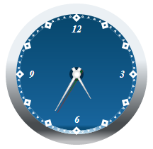

# GaugeObject.Shadow

GaugeObject.Shadow
-

# GaugeObject.Shadow

## Синтаксис

Shadow: PP.Ui.DropShadow;

## Описание

Свойство Shadow определяет тень для элемента.

## Пример

Для выполнения примера предполагается наличие на странице компонента [Speedometer](../../../Components/Speedometer/Speedometer.htm) с наименованием «speed1», содержащего одну стрелку и шкалу (см. «[Пример создания стрелочных часов](../../../Components/Speedometer/Clock_Example.htm)»). Добавим на страницу кнопку, после нажатия на которую будет определено смещение тени от базового элемента:

<input TYPE="button" VALUE="Shadow" ONCLICK="shadow()">

После нажатия на кнопку «Shadow» будет отображена тень для стрелки:

См. также:

[GaugeObject](GaugeObject.htm)

		Справочная
		 система на версию 10.9
		 от 18/08/2025,
		 © ООО «ФОРСАЙТ»,
