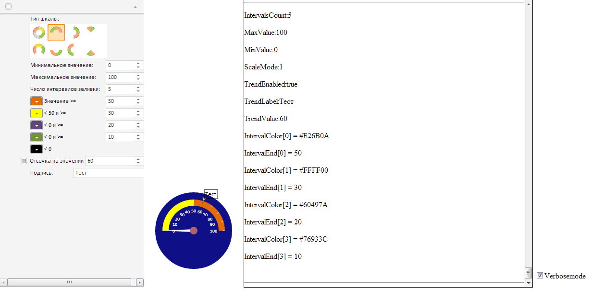

# GaugeProperties.IntervalColor

GaugeProperties.IntervalColor
-

# GaugeProperties.IntervalColor

## Синтаксис

IntervalColor: Array;

## Описание

Свойство IntervalColor устанавливает массив цветов сектора.

## Пример

Для выполнения примера необходимо наличие на странице компонента [GaugeProperties](GaugeProperties.htm) с наименованием «prop» (см. «Пример работы с мастером настройки спидометров»). Добавим обработчик события PropertyChanged:

prop.PropertyChanged.add(
function (sender, args)
{
	var log = document.getElementById("log");
	log.innerHTML += "
ScaleMode:" + prop.getScaleMode();
	log.innerHTML += "
MaxValue:" + prop.getMaxValue();
	log.innerHTML += "
MinValue:" + prop.getMinValue();
	log.innerHTML += "
IntervalsCount:" + prop.getIntervalsCount();
	log.innerHTML += "
TrendEnabled:" + prop.getTrendEnabled();
	log.innerHTML += "
TrendLabel:" + prop.getTrendLabel();
	log.innerHTML += "
TrendValue:" + prop.getTrendValue();
	for (var i = 0; i < prop.getIntervalsCount() - 1; i++)
	{
		log.innerHTML += "
IntervalColor[" + i + "] = " + prop.getIntervalColor(i);
		log.innerHTML += "
IntervalEnd[" + i + "] = " + prop.getIntervalEnd(i);
	}
	log.innerHTML += " 
";
	log.scrollTop = log.scrollHeight - log.clientHeight;
	prop.update();
});

При изменении свойств спидометра в мастере в текстовое окно будут выведены настройки спидометра:

См. также:

[GaugeProperties](GaugeProperties.htm)

		Справочная
		 система на версию 10.9
		 от 18/08/2025,
		 © ООО «ФОРСАЙТ»,
