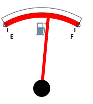

# Конструктор GaugeScale

Конструктор GaugeScale
-

# Конструктор GaugeScale

## Синтаксис

PP.Ui.GaugeScale(settings);

## Параметры

settings. JSON-объект со значениями свойств компонента.

## Описание

Конструктор GaugeScale создает экземпляр класса [GaugeScale](GaugeScale.htm).

## Пример

Для выполнения примера предполагается наличие на странице компонента [Speedometer](../../../Components/Speedometer/Speedometer.htm) с наименованием «speed1» (см. «[Пример создания датчика топлива](../../../Components/Speedometer/Fuel_gauge_Example.htm)»). Добавим на страницу кнопку при нажатии на которую будет создан элемент спидометра в виде шкалы:

<input TYPE="button" VALUE="GaugeScale" ONCLICK="ScaleConstructor()">

После нажатия на кнопку «GaugeScale» появится элемент спидометра в виде шкалы, имеющий следующий вид:

См. также:

[GaugeScale](GaugeScale.htm)

		Справочная
		 система на версию 10.9
		 от 18/08/2025,
		 © ООО «ФОРСАЙТ»,
