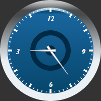

# GaugeScale.Direction

GaugeScale.Direction
-

**

# GaugeScale.Direction

## Синтаксис

Direction: Boolean;

## Описание

Свойство Direction определяет направление отрисовки шкалы спидометра.

## Комментарии

Значение свойства устанавливается из JSON и с помощью метода setDirection, а возвращается с помощью метода getDirection.**

**Если свойство имеет значение true, то шкала будет отрисована** слева направо по часовой стрелке, иначе - справа налево против часовой стрелки.

## Пример

Для выполнения примера предполагается наличие на странице компонента [Speedometer](../../../Components/Speedometer/Speedometer.htm) с наименованием «speed1» (см. «[Пример создания стрелочных часов](../../../Components/Speedometer/Clock_Example.htm)»). Установим отрисовку шкал спидометра против часовой стрелки. Установим измерение смещения секторов в процентах. Получим сектор по имени и установим для него смещение относительно шкалы:

// Получим шкалу спидометра
var scale = speed1.getScales()[0];
// Установим отрисовку шкал против часовой стрелки
scale.setDirection(false);
speed1.getScales()[1].setDirection(false);
// Установим измерение смещения секторов в процентах
scale.setIsAbsoluteSectorOffset(false);
// Получим сектор по имени
var sector = scale.getSectorByName("Sector1")[0];
// Установим смещение относительно шкалы для полученного сектора
sector.setOffset(0.5);

В результате выполнения примера шкалы спидометра были отрисованы против часовой стрелки. Было установлено измерение смещения секторов в процентах. Для полученного сектора было установлено смещение относительно шкалы:

См. также:

[GaugeScale](GaugeScale.htm)

		Справочная
		 система на версию 10.9
		 от 18/08/2025,
		 © ООО «ФОРСАЙТ»,
