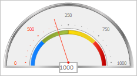
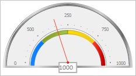

# GaugeScale.EnablePassedStyles

GaugeScale.EnablePassedStyles
-

# GaugeScale.EnablePassedStyles

## Синтаксис

EnablePassedStyles: Boolean;

## Описание

Свойство EnablePassedStyles определяет признак использования стилей для пройденных маркеров и текстовых меток шкалы спидометра главным указателем этой шкалы.

## Комментарии

Значение свойства устанавливается из JSON и с помощью метода setEnablePassedStyles, а возвращается с помощью метода getEnablePassedStyles.

Если свойство имеет значение true, то стили для пройденных значений шкалы будут использоваться, иначе - не будут.

## Пример

Для выполнения примера предполагается наличие на странице компонента [Speedometer](../../../Components/Speedometer/Speedometer.htm) с наименованием «speedometer» (см. «[Пример создания спидометра с мастером](../../../Components/Speedometer/speedometer_wirh_master.htm)»).

Получим указатель шкалы спидометра и запретим использование прозрачности для него. Установим длину указателя и его значение. Обновим маркеры шкалы и перерисуем текстовые метки. Получим центральную текстовую метку спидометра и установим выравнивание текста в ней по левой стороне:

// Получим шкалу спидометра
var scale = speedometer.getScales()[3];
// Получим указатель шкалы по имени
var arrow = scale.getArrowByName("Arrow1")[0];
// Запретим использование прозрачности
arrow.setOpacityEnabled(false);
// Установим длину указателя
arrow.setRadius(0.8);
// Установим значение указателя
arrow.setValue(400);
// Обновим маркеры шкалы
scale.refreshTicks();
// Перерисуем текстовые метки
scale.redrawLabels();
// Получим центральную текстовую метку спидометра
var label = speedometer.getCenterLabel();
// Установим выравнивание текста по левой стороне
label.setTextAlign(PP.HorizontalAlignment.Left);

В результате были изменены свойства полученного указателя. После изменения значения указателя для пройденных меток шкалы спидометра были применены соответствующие стили. Было установлено выравнивание текста центральной текстовой метки по левой стороне:

Запретим использование стилей для пройденных значений шкалы:

// Запретим использование стилей для пройденных значений
scale.setEnablePassedStyles(false);

В результате было запрещено использование стилей для пройденных значений шкалы:

См. также:

[GaugeScale](GaugeScale.htm)

		Справочная
		 система на версию 10.9
		 от 18/08/2025,
		 © ООО «ФОРСАЙТ»,
