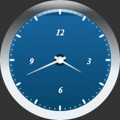

# GaugeScale.IsAbsoluteLabelOffset

GaugeScale.IsAbsoluteLabelOffset
-

**

# GaugeScale.IsAbsoluteLabelOffset

## Синтаксис

IsAbsoluteLabelOffset: Boolean;

## Описание

Свойство IsAbsoluteLabelOffset определяет, в каких единицах указывается смещение текстовых меток шкалы.

## Комментарии

Значение свойства устанавливается из JSON и с помощью метода setIsAbsoluteLabelOffset, а возвращается с помощью метода getIsAbsoluteLabelOffset.**

**Е****сли свойство имеет значение true (по умолчанию), то смещение будет указываться в пикселях, иначе - в процентах.**

## Пример

Для выполнения примера предполагается наличие на странице компонента [Speedometer](../../../Components/Speedometer/Speedometer.htm) с наименованием «speed1» (см. «[Пример создания стрелочных часов](../../../Components/Speedometer/Clock_Example.htm)»).

Установим измерение смещения текстовых меток шкалы в процентах и изменим значение самого смещения:

// Получим шкалу спидометра
var scale = speed1.getScales()[0];
// Установим измерение смещения текстовых меток в процентах
scale.setIsAbsoluteLabelOffset(false);
// Установим смещение текстовых меток шкалы
scale.setLabelOffset(-0.2);

В результате было изменено смещение текстовых меток шкалы:

См. также:

[GaugeScale](GaugeScale.htm)

		Справочная
		 система на версию 10.9
		 от 18/08/2025,
		 © ООО «ФОРСАЙТ»,
