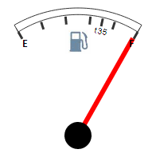

# GaugeScale.MaskLabel

GaugeScale.MaskLabel
-

# GaugeScale.MaskLabel

## Синтаксис

MaskLabel: String;

## Описание

Свойство MaskLabel определяет формат вывода значения в подписи.

## Комментарии

Свойство актуально только для тех значений, для которых ранее не была установлена подпись, которая определяется свойством [Labels](GaugeScale.Labels.htm).

## Пример

Для выполнения примера предполагается наличие на странице компонента [Speedometer](../../../Components/Speedometer/Speedometer.htm) с наименованием «speed1» (см. «[Пример создания датчика топлива](../../../Components/Speedometer/Fuel_gauge_Example.htm)»). Добавим на страницу кнопку, при нажатии на которую появится подпись, формат которой определен по маске:

<input TYPE="button" VALUE="MaskLabel" ONCLICK="TestMaskLabel()">

 После нажатия на кнопку «MaskLabel» будет добавлена подпись, имеющая следующий вид:

См. также:

[GaugeScale](GaugeScale.htm)

		Справочная
		 система на версию 10.9
		 от 18/08/2025,
		 © ООО «ФОРСАЙТ»,
