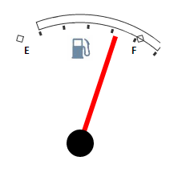

# GaugeScale.Rotate

GaugeScale.Rotate
-

# GaugeScale.Rotate

## Синтаксис

Rotate: Number;

## Описание

Свойство Rotate определяет угол вращения шкалы.

## Пример

Для выполнения примера предполагается наличие на странице компонента [Speedometer](../../../Components/Speedometer/Speedometer.htm) с наименованием «speed1» (см. «[Пример создания датчика топлива](../../../Components/Speedometer/Fuel_gauge_Example.htm)»). Добавим на страницу кнопку, при нажатии на которую будет выполнен поворот шкалы:

<input TYPE="button" VALUE="Rotate" ONCLICK="Rotate()">

После нажатия на кнопку «Rotate» будет выполнен поворот шкалы спидометра на 10 градусов по часовой стрелке.

См. также:

[GaugeScale](GaugeScale.htm)

		Справочная
		 система на версию 10.9
		 от 18/08/2025,
		 © ООО «ФОРСАЙТ»,
