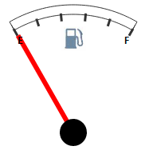
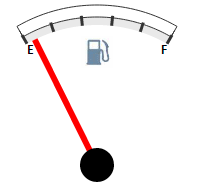

# GaugeScale.Size

GaugeScale.Size
-

# GaugeScale.Size

## Синтаксис

Size: Number;

## Описание

Свойство Size определяет ширину шкалы.

## Комментарии

Если свойству Size задано значение 0, то шкала не отображается и [Speedometer](../../../Components/Speedometer/Speedometer.htm) будет иметь следующий вид:

Если свойству Size задано значение 10, шкала будет отображаться согласно настройкам и [Speedometer](../../../Components/Speedometer/Speedometer.htm) будет иметь следующий вид (появится серая шкала):

## Пример

Пример использования свойства Size показан на странице «[Пример создания датчика топлива](../../../Components/Speedometer/Fuel_gauge_Example.htm)».

См. также:

[GaugeScale](GaugeScale.htm)

		Справочная
		 система на версию 10.9
		 от 18/08/2025,
		 © ООО «ФОРСАЙТ»,
