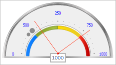

# GaugeScale.addArrow

GaugeScale.addArrow
-

# GaugeScale.addArrow

## Синтаксис

addArrow(arrow: [PP.Ui.GaugeArrowBase](../GaugeArrowBase/GaugeArrowBase.htm) || Array);

## Параметры

arrow. Добавляемый указатель или массив указателей.

## Описание

Метод addArrow добавляет новый указатель или массив указателей в шкалу спидометра.

## Пример

Для выполнения примера предполагается наличие на странице компонента [Speedometer](../../../Components/Speedometer/Speedometer.htm) с наименованием «speedometer» (см. «[Пример создания спидометра с мастером](../../../Components/Speedometer/speedometer_wirh_master.htm)»).

Создадим новые указатели. Один из них добавим в шкалу, а другой установим вместо существующего указателя с индексом 0. Изменим цвет текстовых меток шкалы. Выведем значение первого указателя шкалы и количество текстовых меток. Получим основной и дополнительный маркер шкалы с указанными индексами и изменим их размеры. Получим и выведем данные о размере и позиции шкалы:

// Получим шкалу спидометра
var scale = speedometer.getScales()[3];
// Определим настройки указателя
var arrowSettings = {
    Value: 300, // Значение указателя
    Radius: 80, // Длина указателя
    Border: { // Граница указателя
        PPType: PP.SolidColorBrush,
        Color: "#ff462c"
    }
}
// Создадим новый указатель
var arrow1 = new PP.Ui.LineArrow(arrowSettings);
// Добавим указатель в спидометр
scale.addArrow(arrow1);
// Создадим новый указатель
var arrow2 = new PP.Ui.LineArrow(arrowSettings);
// Установим значение указателя
arrow2.setValue(800);
// Установим новый указатель с индексом 0
scale.setArrow(arrow2, 0);
// Установим цвет текстовых меток шкалы
scale.setLabelsColor(PP.Color.Colors.blue);
// Выведем значение первого указателя
console.log("Значение первого указателя шкалы: " + scale.getArrowValue(scale.getArrows(0)));
// Выведем количество текстовых меток шкалы
console.log("Количество текстовых меток шкалы: " + scale.getLabelset().length);
// Получим основной маркер шкалы с индексом 1
var majorTick = scale.getMajorTicks(1);
majorTick.setSize(0.1);
// Получим дополнительный маркер шкалы с индексом 3
var minorTick = scale.getMinorTicks(3);
minorTick.setSize(0.07);
// Получим и выведем данные о размере и позиции шкалы
var rInfo = scale.getRenderInfo();
console.log("Шкала с радиусами x = " + rInfo.radius.x + ", y = " + rInfo.radius.y +
  " имеет центр в точке (" + rInfo.center.x + ", " + rInfo.center.y + ")");

В результате выполнения примера в шкалу был добавлен новый указатель и заменен существующий указатель. Был изменен цвет текстовых меток шкалы и размер главного и дополнительного маркера с указанными индексами:

Также в консоли браузера было выведено значение первого указателя шкалы, количество текстовых меток и информация о размере и позиции шкалы:

Значение первого указателя шкалы: 800

Количество текстовых меток шкалы: 5

Шкала с радиусами x = 0.95, y = 0.875 имеет центр в точке (110, 107)

См. также:

[GaugeScale](GaugeScale.htm)

		Справочная
		 система на версию 10.9
		 от 18/08/2025,
		 © ООО «ФОРСАЙТ»,
