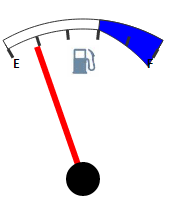

# Конструктор GaugeSector

Конструктор GaugeSector
-

# Конструктор GaugeSector

## Синтаксис

PP.Ui.GaugeSector (settings);

## Параметры

settings. JSON-объект со значениями свойств компонента.

## Описание

Конструктор GaugeSector создает экземпляр класса [GaugeSector](GaugeSector.htm).

## Пример

Для выполнения примера предполагается наличие на странице компонента [Speedometer](../../../Components/Speedometer/Speedometer.htm) с наименованием «speed1» (см. «[Пример создания датчика топлива](../../../Components/Speedometer/Fuel_gauge_Example.htm)»). Добавим кнопку, при нажатии на которую будет создан и размещен на шкале элемент спидометра, представленный в виде сектора:

<input TYPE="button" VALUE="GaugeSector" ONCLICK="SectorConstructor()">

После нажатия на кнопку «GaugeSector» появится элемент спидометра в виде сектора, имеющий следующий вид:

См. также:

[GaugeSector](GaugeSector.htm)

		Справочная
		 система на версию 10.9
		 от 18/08/2025,
		 © ООО «ФОРСАЙТ»,
