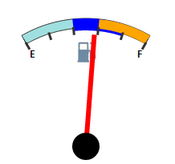

# GaugeSector.ZIndex

GaugeSector.ZIndex
-

# GaugeSector.ZIndex

## Синтаксис

ZIndex: Number;

## Описание

Свойство ZIndex определяет порядок расположения слоев в секторе.

## Пример

Для выполнения примера предполагается наличие на странице компонента [Speedometer](../../../Components/Speedometer/Speedometer.htm) с наименованием «speed1» (см. «[Пример создания датчика топлива](../../../Components/Speedometer/Fuel_gauge_Example.htm)»). Добавим на страницу кнопку, при нажатии на которую будет меняться порядок расположения секторов:

<input TYPE="button" VALUE="createSector" ONCLICK="createSector()">

<input TYPE="button" VALUE="setZIndex" ONCLICK="setZIndex()">

При нажатии на кнопку «createSector» будут добавлены три пересекающихся сектора. Затем, нажатием кнопки «setZIndex», можно менять порядок расположения этих секторов.

См. также:

[GaugeSector](GaugeSector.htm)

		Справочная
		 система на версию 10.9
		 от 18/08/2025,
		 © ООО «ФОРСАЙТ»,
