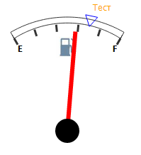

# Конструктор GaugeTextLabel

Конструктор GaugeTextLabel
-

# Конструктор GaugeTextLabel

## Синтаксис

PP.Ui.GaugeTextLabel(settings);

## Параметры

settings. JSON-объект со значениями свойств компонента.

## Описание

Конструктор GaugeTextLabel создает экземпляр класса [GaugeTextLabel](GaugeTextLabel.htm).

## Пример

Для выполнения примера предполагается наличие на странице компонента [Speedometer](../../../Components/Speedometer/Speedometer.htm) с наименованием «speed1» (см. «[Пример создания датчика топлива](../../../Components/Speedometer/Fuel_gauge_Example.htm)»). Добавим на страницу кнопку, при нажатии на которую добавится текстовая метка:

<input TYPE="button" VALUE="GaugeTextLabel" ONCLICK="TestTrendPoint()">

После нажатия на кнопку «GaugeTextLabel» на шкале спидометра будет размещена текстовая метка, имеющая следующий вид:

См. также:

[GaugeTextLabel](GaugeTextLabel.htm)

		Справочная
		 система на версию 10.9
		 от 18/08/2025,
		 © ООО «ФОРСАЙТ»,
