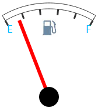

# GaugeTextLabel.Font

GaugeTextLabel.Font
-

# GaugeTextLabel.Font

## Синтаксис

Font: PP.[Font](dhtmlCommon.chm::/Classes/PP/Font/Font.htm);

## Описание

Свойство Font определяет шрифт
 текстовой метки.

## Пример

Для выполнения примера предполагается наличие на странице компонента
 [Speedometer](../../../Components/Speedometer/Speedometer.htm)
 с наименованием «speed1» (см. «[Пример
 создания датчика топлива](../../../Components/Speedometer/Fuel_gauge_Example.htm)»). Добавим на страницу кнопку, после нажатия
 на которую будет изменен размер и цвет текстовой метки:

<input type="button" value="Font" onclick="Font()" />

После нажатия на кнопку «Font» будет изменен размер и цвет текстовых
 меток «E» и «F»:

См. также:

[GaugeTextLabel](GaugeTextLabel.htm)

		Справочная
		 система на версию 10.9
		 от 18/08/2025,
		 © ООО «ФОРСАЙТ»,
