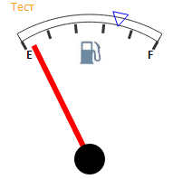

# GaugeTextLabel.setPosition

GaugeTextLabel.setPosition
-

# GaugeTextLabel.setPosition

## Синтаксис

setPosition(at, dontRedraw);

## Параметры

at. Координаты точки, определяющей положение текстовой метки;

dontRedraw.  Если установлен значение false будет выполнена перерисовка спидометра.

## Описание

Метод setPosition устанавливает положение текстовой метки.

## Пример

Для выполнения примера предполагается наличие на странице компонента [Speedometer](../../../Components/Speedometer/Speedometer.htm) с наименованием «speed1» (см. «[Пример создания датчика топлива](../../../Components/Speedometer/Fuel_gauge_Example.htm)»). Добавим на страницу кнопку, после нажатия на которую будет создана текстовая метка на шкале спидометра:

<input TYPE=«button» VALUE=«setPosition» ONCLICK=«setPosition()»>

После нажатия на кнопку «setPosition» будет отображена метка в форме треугольника, а также изменено положение текстовой метки.

См. также:

[GaugeTextLabel](GaugeTextLabel.htm)

		Справочная
		 система на версию 10.9
		 от 18/08/2025,
		 © ООО «ФОРСАЙТ»,
