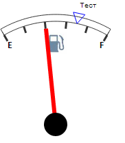

# Конструктор GaugeTrendPoint

Конструктор GaugeTrendPoint
-

# Конструктор GaugeTrendPoint

## Синтаксис

PP.Ui.GaugeTrendPoint (settings);

## Параметры

settings. JSON-объект со значениями
 свойств компонента.

## Описание

Конструктор GaugeTrendPoint создает
 экземпляр класса [GaugeTrendPoint](GaugeTrendPoint.htm).

## Пример

Для выполнения примера предполагается наличие на странице компонента
 [Speedometer](../../../Components/Speedometer/Speedometer.htm)
 с наименованием «speed1» (см. «[Пример
 создания датчика топлива](../../../Components/Speedometer/Fuel_gauge_Example.htm)»). Добавим на страницу кнопку, при нажатии
 на которую будет создана отметка на шкале спидометра:

<input TYPE="button" VALUE="GaugeTrendPoint" ONCLICK="GaugeTrendPoint()">

После нажатия на кнопку «GaugeTrendPoint» будет размещена отметка на
 шкале спидометра, имеющая следующий вид:

Также будут выведены значения параметров спидометра, возвращенные методами
 [calcCenterPosition](GaugeTrendPoint.calcCenterPosition.htm),
 [calcOuterRadius](GaugeTrendPoint.calcOuterRadius.htm):

GaugeTrendPoint.calcCenterPosition() - X:100 Y:180

GaugeTrendPoint.calcOuterRadius() - X:150 Y:150

См. также:

[GaugeTrendPoint](GaugeTrendPoint.htm)

		Справочная
		 система на версию 10.9
		 от 18/08/2025,
		 © ООО «ФОРСАЙТ»,
