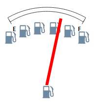

# Конструктор ImageMarker

Конструктор ImageMarker
-

# Конструктор ImageMarker

## Синтаксис

PP.Ui.ImageMarker (setting);

## Параметры

settings. JSON-объект со значениями свойств компонента.

## Описание

Конструктор ImageMarker создает экземпляр класса [ImageMarker](ImageMarker.htm).

## Пример

Для выполнения примера предполагается наличие на странице компонента [Speedometer](../../../Components/Speedometer/Speedometer.htm) с наименованием «speed1» (см. «[Пример создания датчика топлива](../../../Components/Speedometer/Fuel_gauge_Example.htm)») и файл «Fuel_icon.png» должен храниться на одном уровне с html-страницей. Добавим на страницу кнопку, при нажатии на которую будут добавляться маркеры в виде изображения:

<input TYPE="button" VALUE=" image Marker " ONCLICK="imageMarker()">

После нажатия на кнопку «Image Marker» маркеры на шкале спидометра и в его центре будут изменены следующим образом:

См. также:

[ImageMarker](ImageMarker.htm)

		Справочная
		 система на версию 10.9
		 от 18/08/2025,
		 © ООО «ФОРСАЙТ»,
