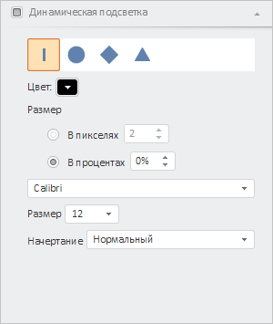

# LightBrushPanel.setEnabledSettings

LightBrushPanel.setEnabledSettings
-

# LightBrushPanel.setEnabledSettings

## Синтаксис

setEnabledSettings(args: PP.Ui.PropertyChangedEventArgs);

## Параметры

args. Настройки доступности
 панели в мастере спидометра.

## Описание

Метод setEnabledSettings устанавливает
 настройки доступности панели «Динамическая подсветка» в мастере спидометра.

## Пример

Для выполнения примера предполагается наличие на странице компонента
 [GaugeMaster](../../../Components/Speedometer/GaugeMaster.htm)
 с наименованием «master» (см. «[Пример
 создания спидометра с мастером](../../../Components/Speedometer/speedometer_wirh_master.htm)»). Сделаем панель «Динамическая подсветка»
 в мастере спидометра доступной:

// Получаем панель «Динамическая подсветка»
var panel = master.getItem(PP.Ui.LightBrushPanel);
// Раскрываем панель
panel.expand();
// Определяем настройки панели
var args = new PP.Ui.PropertyChangedEventArgs({
    PropertyName: "GaugeSettings",
    Metadata: [{
        Name: "gaugeMaster.brushPanel.globalEnable",
        Value: true
    }, {
        Name: "gaugeMaster.brushPanel.enable",
        Value: true
    }]
});
// Делаем панель доступной
panel.setEnabledSettings(args);
В результате выполнения примера панель для настройки динамической подсветки
 спидометра стала доступной:

См. также:

[LightBrushPanel](LightBrushPanel.htm)

		Справочная
		 система на версию 10.9
		 от 18/08/2025,
		 © ООО «ФОРСАЙТ»,
