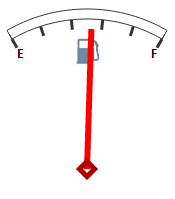

# Конструктор RhombMarker

Конструктор RhombMarker
-

# Конструктор RhombMarker

## Синтаксис

PP.Ui.RhombMarker (setting);

## Параметры

settings. JSON-объект со значениями свойств компонента.

## Описание

Конструктор RhombMarker создает экземпляр класса [RhombMarker](RhombMarker.htm).

## Пример

Для выполнения примера предполагается наличие на странице компонента [Speedometer](../../../Components/Speedometer/Speedometer.htm) с наименованием «speed1» (см. «[Пример создания датчика топлива](../../../Components/Speedometer/Fuel_gauge_Example.htm)»). Добавим на страницу кнопку, при нажатии на которую в центр спидометра будет добавлен маркер в виде ромба:

<input TYPE="button" VALUE=" OK " ONCLICK="RMarks()">

После нажатия на кнопку «OK» маркер в центре спидометра будет изменен следующим образом:

См. также:

[RhombMarker](RhombMarker.htm)

		Справочная
		 система на версию 10.9
		 от 18/08/2025,
		 © ООО «ФОРСАЙТ»,
