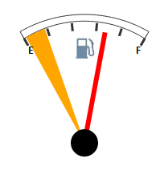

# Конструктор SectorArrow

Конструктор SectorArrow
-

# Конструктор SectorArrow

## Синтаксис

PP.Ui.SectorArrow(settings);

## Параметры

settings. JSON-объект со значениями свойств компонента.

## Описание

Конструктор SectorArrow создает экземпляр класса [SectorArrow](SectorArrow.htm).

## Пример

Для выполнения примера предполагается наличие на странице компонента [Speedometer](../../../Components/Speedometer/Speedometer.htm) с наименованием «speed1» (см. «[Пример создания датчика топлива](../../../Components/Speedometer/Fuel_gauge_Example.htm)»). Добавим на страницу кнопку, при нажатии на которую будет добавлен указатель в виде сектора:

<input TYPE="button" VALUE="ArrowConstructor" ONCLICK="ArrowConstructor()">

После нажатия на кнопку «ArrowConstructor» будет добавлен указатель в виде сектора:

См. также:

[SectorArrow](SectorArrow.htm)

		Справочная
		 система на версию 10.9
		 от 18/08/2025,
		 © ООО «ФОРСАЙТ»,
