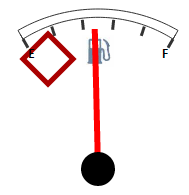

# Speedometer.Markers

Speedometer.Markers
-

# Speedometer.Markers

## Синтаксис

Markers: Array;

## Описание

Свойство Markers определяет
 массив типа PP.Ui.[GaugeMarkerBase](../GaugeMarkerBase/GaugeMarkerBase.htm)
 из элементов, задающих параметры отрисовки маркеров спидометра.

## Пример

Для выполнения примера предполагается наличие на странице компонента
 [Speedometer](../../../Components/Speedometer/Speedometer.htm)
 с наименованием «speed1» (см. «[Пример
 создания датчика топлива](../../../Components/Speedometer/Fuel_gauge_Example.htm)»). Добавим на страницу кнопку, после
 нажатия на которую будет отображен маркер спидометра, определяемый свойством
 Markers:

<input TYPE="button" VALUE="Speedometer.Markers" ONCLICK="Test1()">

После нажатия на кнопку «Speedometer.Markers» будет отображен
 маркер спидометра, который имеет следующий вид:

См. также:

[Speedometer](Speedometer.htm)

		Справочная
		 система на версию 10.9
		 от 18/08/2025,
		 © ООО «ФОРСАЙТ»,
