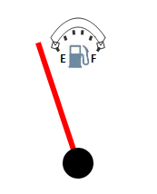

# Speedometer.OuterRadius

Speedometer.OuterRadius
-

# Speedometer.OuterRadius

## Синтаксис

OuterRadius: PP.[Point](dhtmlCommon.chm::/Classes/PP/Point/Point.htm);

## Описание

Свойство OuterRadius определяет
 область отрисовки шкалы спидометра относительно его центра.

## Пример

Пример использования свойства OuterRadius
  показан на странице «[Пример
 создания датчика топлива](../../../Components/Speedometer/Fuel_gauge_Example.htm)».

При значении OuterRadius: "150, 150" имеем следующий вид спидометра:

Изменив значение на OuterRadius: "50, 150", получим шкалу
 спидометра следующего вида:

См. также:

[Speedometer](Speedometer.htm)

		Справочная
		 система на версию 10.9
		 от 18/08/2025,
		 © ООО «ФОРСАЙТ»,
