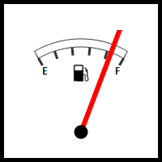

# Speedometer.Padding

Speedometer.Padding
-

# Speedometer.Padding

## Синтаксис

Padding: [PP.Thickness](dhtmlCommon.chm::/Classes/PP/Thickness/Thickness.htm);

## Описание

Свойство Padding определяет
 отступы компонента.

## Комментарии

Значение свойства устанавливается из JSON и с помощью метода setPadding,
 а возвращается с помощью метода getPadding.

## Пример

Для выполнения примера предполагается наличие на странице компонента
 [Speedometer](../../../Components/Speedometer/Speedometer.htm)
 с наименованием «speed1» (см. «[Пример
 создания датчика топлива](../../../Components/Speedometer/Fuel_gauge_Example.htm)»).

Установим значение отступов спидометра, обработаем событие [Refreshed](Speedometer.Refreshed.htm).
 Определим и установим настройки, отображающие границу спидометра. Обновим
 представление спидометра, установив значение толщины границы:

// Установим значение отступов
speed1.setPadding(25);
// Обработаем событие обновления спидометра
speed1.Refreshed.add(function (sender, eventArgs, timeout) {
    console.log("Инициировано событие Refreshed");
});
// Определим настройки, отображающие границу
var metadata = [{
    Name: "gaugeMaster.speedometerPanel.borderEnable",
    Value: true
}]
// Установим настройки
speed1.setMasterSettings(metadata);
// Обновим представление спидометра, установив значение толщины границы
speed1.refreshView(new PP.Ui.PropertyChangedEventArgs({
    PropertyName: 'GaugeSettings',
    Metadata: [{
        Name: "gaugeMaster.speedometerPanel.borderPanel.thickness",
        Value: 5
    }]
}));
В результате выполнения примера были изменены отступы спидометра, была
 отображена граница:

Также в консоли браузера было выведено сообщение о вызове обработанного
 события:

Инициировано событие Refreshed

См. также:

[Speedometer](Speedometer.htm)

		Справочная
		 система на версию 10.9
		 от 18/08/2025,
		 © ООО «ФОРСАЙТ»,
