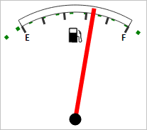

# Speedometer.getArrowById

Speedometer.getArrowById
-

# Speedometer.getArrowById

## Синтаксис

getArrowById(id: String);

## Параметры

id. Идентификатор указателя. Опциональный параметр. Если параметр не указывается, то метод возвращает первый найденный указатель.

## Описание

Метод getArrowById возвращает указатель по его идентификатору.

## Комментарии

Метод возвращает значение типа [PP.Ui.GaugeArrowBase](../GaugeArrowBase/GaugeArrowBase.htm).

## Пример

Для выполнения примера предполагается наличие на странице компонента [Speedometer](../../../Components/Speedometer/Speedometer.htm) с наименованием «speed1» (см. «[Пример создания датчика топлива](../../../Components/Speedometer/Fuel_gauge_Example.htm)»).

Получим указатель шкалы, установим относительный тип измерения радиуса (длины) указателя и изменим само значение радиуса. Установим границу и изменим её стиль, перерисуем спидометр. Получим и выведем значения следующих свойств: отношение указателя спидометра к радиусу самого спидометра, признак корректности значения указателя, количество основных маркеров шкалы указателя, количество дочерних элементов спидометра, идентификатор спидометра, признак использования прозрачности спидометра, количество полей настроек шкалы спидометра, количество дочерних SVG-элементов спидометра, текущий шаг временной шкалы, идентификатор атрибута измерения указателя:

// Получим указатель шкалы
var arrow = speed1.getArrowById();
// Установим относительный тип измерения длины указателя
arrow.setRadiusUnit(PP.Ui.Speedometer.SizeUnit.Relative);
// Установим новое значение длины указателя
arrow.setRadius(0.007)
// Установим границу
speed1._Border = PP.Color.Colors.green;
speed1._BorderWidth = 5;
// Установим стиль границы
speed1.setBorderStyle(PP.Ui.LineTypes.Dot)
// Перерисуем спидометр
speed1.paint();
// Выведем отношение радиуса указателя спидометра к радиусу самого спидометра
console.log("Отношение указателя спидометра к радиусу самого спидометра: " + arrow.getAutoResKoef());
// Выведем результат проверки значения указателя на корректность
console.log("Признак корректности значения указателя: " + arrow.getIsValid());
// Выведем количество основных маркеров шкалы указателя
console.log("Количество основных маркеров шкалы указателя: " + arrow.getScale().getMajorTicks().length);
// Выведем количество дочерних элементов спидометра
console.log("Количество дочерних элементов спидометра: " + speed1.getChildren().length);
// Выведем идентификатор спидометра
console.log("Идентификатор спидометра: " + speed1.getInstance().getId());
// Выведем признак использования прозрачности
console.log("Признак использования прозрачности: " + speed1.getOpacityEnabled());
// Выведем количество полей настроек шкалы
console.log("Количество полей настроек шкалы: " + speed1.getState().getMetadata().length);
// Выведем количество дочерних SVG-элементов спидометра
console.log("Количество дочерних SVG-элементов спидометра: " + speed1.getSVGNode().childElementCount);
// Выведем текущий шаг временной шкалы
console.log("Текущий шаг временной шкалы: " + speed1.getTimelineStep());
// Выведем идентификатор атрибута измерения указателя
console.log("Идентификатор атрибута измерения указателя: " + arrow.getDimAttributeId());

В результате выполнения примера было установлено новое значение длины указателя и отображена граница:

Также в консоли браузеры были выведены значения следующий свойств: отношение указателя спидометра к радиусу самого спидометра, признак корректности значения указателя, количество основных маркеров шкалы указателя, количество дочерних элементов спидометра, идентификатор спидометра, признак использования прозрачности спидометра, количество полей настроек шкалы спидометра, количество дочерних SVG-элементов спидометра, текущий шаг временной шкалы, идентификатор атрибута измерения указателя:

Отношение указателя спидометра к радиусу самого спидометра: 0.9333333333333333

Признак корректности значения указателя: true

Количество основных маркеров шкалы указателя: 6

Количество дочерних элементов спидометра: 4

Идентификатор спидометра: Speedometer262

Признак использования прозрачности: true

Количество полей настроек шкалы: 82

Количество дочерних SVG-элементов спидометра: 5

Текущий шаг временной шкалы: 0

Идентификатор атрибута измерения указателя: attr1

См. также:

[Speedometer](Speedometer.htm)

		Справочная
		 система на версию 10.9
		 от 18/08/2025,
		 © ООО «ФОРСАЙТ»,
