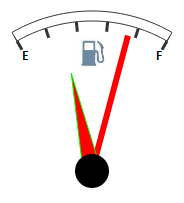

# Конструктор TriangleArrow

Конструктор TriangleArrow
-

# Конструктор TriangleArrow

## Синтаксис

PP.Ui.TriangleArrow(settings);

## Параметры

settings. JSON-объект со значениями
 свойств компонента.

## Описание

Конструктор TriangleArrow создает
 экземпляр класса [TriangleArrow](TriangleArrow.htm).

## Пример

Для выполнения примера предполагается наличие на странице компонента
 [Speedometer](../../../Components/Speedometer/Speedometer.htm)
 с наименованием «speed1» (см. «[Пример
 создания датчика топлива](../../../Components/Speedometer/Fuel_gauge_Example.htm)»). Добавим на страницу кнопку, при нажатии
 на которую будет добавлена стрелка в виде треугольника:

<input TYPE="button" VALUE="ArrowConstructor" ONCLICK="ArrowConstructor()">

После нажатия на кнопку «ArrowConstructor» добавится
 стрелка в виде треугольника:

См. также:

[TriangleArrow](TriangleArrow.htm)

		Справочная
		 система на версию 10.9
		 от 18/08/2025,
		 © ООО «ФОРСАЙТ»,
