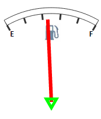

# Конструктор TriangleMarker

Конструктор TriangleMarker
-

# Конструктор TriangleMarker

## Синтаксис

PP.Ui.TriangleMarker (setting);

## Параметры

settings. JSON-объект со значениями свойств компонента.

## Описание

Конструктор TriangleMarker создает экземпляр класса [TriangleMarker](TriangleMarker.htm).

## Пример

Для выполнения примера предполагается наличие на странице компонента [Speedometer](../../../Components/Speedometer/Speedometer.htm) с наименованием «speed1» (см. «[Пример создания датчика топлива](../../../Components/Speedometer/Fuel_gauge_Example.htm)»). Добавим на страницу кнопку, при нажатии на которую в центр спидометра будет добавлен маркер в виде треугольника:

<input TYPE="button" VALUE=" OK " ONCLICK="TMarks()">

После нажатия на кнопку «OK» маркер в центре спидометра будет изменен следующим образом:

См. также:

[TriangleMarker](TriangleMarker.htm)

		Справочная
		 система на версию 10.9
		 от 18/08/2025,
		 © ООО «ФОРСАЙТ»,
