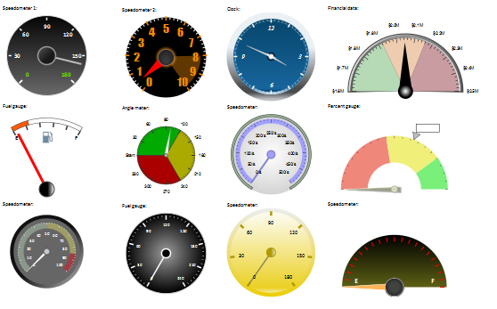
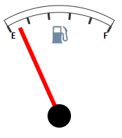
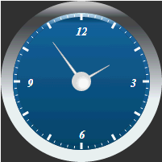

# Speedometer

Speedometer
-

# Speedometer: компонент

## Описание

Компонент Speedometer - это
 визуальный компонент, предназначенный для наглядного отображения набора
 данных с помощью маркированной шкалы. Значение показателей указывает вращающаяся
 вокруг оси стрелка.

## Комментарии

Компонент Speedometer реализован
 с помощью класса [Speedometer](../../Classes/Speedometer/Speedometer/Speedometer.htm).

Для отображения конкретного набора данных компонент использует:

	- радиальную шкалу;

	- индикатор, который движется по кругу, в заданном пределе.

 Для каждого диапазона данных могут быть выбраны различные цвета,
 чтобы показать положения сектора, например, зеленый цвет сектора для удовлетворительного,
 красный цвет сектора для критического значения.

 На всех диаграммах определяется минимальное и максимальное значения
 (нижняя граница, верхняя граница).

 Можно задать цвета диапазонов, чтобы классифицировать данные. Например,
 можно задать диапазон с названием «Best» , который состоит из значений
 между 60 и 100 и определить свой цвет, что поможет визуально отличить
 его от других.

## Пример

 Варианты представления спидометров показаны на рисунке:

Компонент может быть представлен в виде датчика топлива:

Пример создания спидометра показан на странице «[Пример
 создания датчика топлива](Fuel_gauge_Example.htm)».

Вариант представления спидометра в виде стрелочных часов:

Пример создания показан на странице «[Пример
 создания стрелочных часов](Clock_Example.htm)».

[Пример создания спидометра с мастером](speedometer_wirh_master.htm)

## Конструктор

			 Имя конструктора
			 Краткое описание

			 
			 [Speedometer](dhtmlGauge.chm::/Classes/Speedometer/Speedometer/Constructor_Speedometer.htm)
			 Конструктор Speedometer
			 создает экземпляр компонента Speedometer.

## Свойства

		 Имя свойства
		 Краткое описание

		 
		 [Background](dhtmlGauge.chm::/Classes/Speedometer/Speedometer/Speedometer.Background.htm)
		 Свойство Background
		 определяет кисть для заливки фона спидометра.

		 
		 [BaseHeight](dhtmlGauge.chm::/Classes/Speedometer/Speedometer/Speedometer.BaseHeight.htm)
		 Свойство BaseHeight
		 определяет базовую высоту спидометра.

		 
		 [BaseWidth](dhtmlGauge.chm::/Classes/Speedometer/Speedometer/Speedometer.BaseWidth.htm)
		 Свойство BaseWidth
		 определяет базовую ширину спидометра.

		 
		 [Borders](dhtmlGauge.chm::/Classes\Speedometer\Speedometer\Speedometer.Borders.htm)
		 Свойство Borders определяет
		 массив из элементов, задающих параметры отрисовки спидометра.

		 
		 [BorderStyle](dhtmlGauge.chm::/Classes/Speedometer/Speedometer/Speedometer.BorderStyle.htm)
		 Свойство BorderStyle
		 определяет стиль границ спидометра.

		 
		 [Center](dhtmlGauge.chm::/Classes/Speedometer/Speedometer/Speedometer.Center.htm)
		 Свойство Center определяет
		 маркер для отрисовки центра спидометра.

		 
		 [CenterLabel](dhtmlGauge.chm::/Classes/Speedometer/Speedometer/Speedometer.CenterLabel.htm)
		 Свойство CenterLabel
		 определяет центральную текстовую метку спидометра.

		 
		 [CenterPosition](dhtmlGauge.chm::/Classes/Speedometer/Speedometer/Speedometer.CenterPosition.htm)
		 Свойство CenterPosition
		 определяет координаты центра спидометра.

		 
		 [Markers](dhtmlGauge.chm::/Classes/Speedometer/Speedometer/Speedometer.Markers.htm)
		 Свойство Markers определяет
		 массив из элементов, задающих параметры отрисовки маркеров спидометра.

		 
		 [NumberFormat](dhtmlGauge.chm::/Classes/Speedometer/Speedometer/Speedometer.NumberFormat.htm)
		 Свойство NumberFormat
		 определяет формат данных спидометра.

		 
		 [OuterRadius](dhtmlGauge.chm::/Classes/Speedometer/Speedometer/Speedometer.OuterRadius.htm)
		 Свойство OuterRadius
		 определяет радиус спидометра.

		 
		 [Padding](dhtmlGauge.chm::/Classes/Speedometer/Speedometer/Speedometer.Padding.htm)
		 Свойство Padding
		 определяет отступы компонента.

		 
		 [Scales](dhtmlGauge.chm::/Classes/Speedometer/Speedometer/Speedometer.Scales.htm)
		 Свойство Scales определяет
		 массив элементов, задающих параметры отрисовки шкалы спидометра.

		 
		 [TimeLineStep](dhtmlGauge.chm::/Classes/Speedometer/Speedometer/Speedometer.TimeLineStep.htm)
		 Свойство TimeLineStep
		 определяет текущий шаг временной шкалы.

## Методы

		 Имя метода
		 Краткое описание

		 
		 [calcCenterPosition](dhtmlGauge.chm::/Classes/Speedometer/Speedometer/Speedometer.calcCenterPosition.htm)
		 Метод calcCenterPosition вычисляет координаты центра спидометра.

		 
		 [calcOuterRadius](dhtmlGauge.chm::/Classes/Speedometer/Speedometer/Speedometer.calcOuterRadius.htm)
		 Метод calcOuterRadius
		 вычисляет радиус спидометра, если он не задан относительно размеров
		 контейнера.

		 
		 [getArrowById](dhtmlGauge.chm::/Classes/Speedometer/Speedometer/Speedometer.getArrowById.htm)
		 Метод getArrowById
		 возвращает указатель по его идентификатору.

		 
		 [getChildren](dhtmlGauge.chm::/Classes/Speedometer/Speedometer/Speedometer.getChildren.htm)
		 Метод getChildren
		 возвращает массив дочерних элементов спидометра.

		 
		 [getInstance](dhtmlGauge.chm::/Classes/Speedometer/Speedometer/Speedometer.getInstance.htm)
		 Метод getInstance
		 возвращает экземпляр текущего спидометра.

		 
		 [getOpacityEnabled](dhtmlGauge.chm::/Classes/Speedometer/Speedometer/Speedometer.getOpacityEnabled.htm)
		 Метод getOpacityEnabled
		 возвращает признак использования прозрачности спидометром.

		 
		 [getState](dhtmlGauge.chm::/Classes/Speedometer/Speedometer/Speedometer.getState.htm)
		 Метод getState возвращает
		 настройки шкалы спидометра.

		 
		 [getSVGNode](dhtmlGauge.chm::/Classes/Speedometer/Speedometer/Speedometer.getSVGNode.htm)
		 Метод getSVGNode возвращает SVG-элемент, предназначенный для отрисовки спидометра.

		 
		 [paint](dhtmlGauge.chm::/Classes/Speedometer/Speedometer/Speedometer.paint.htm)
		 Метод paint раскрашивает
		 фон и границу SVG-элемента соответственно установкам.

		 
		 [redraw](dhtmlGauge.chm::/Classes/Speedometer/Speedometer/Speedometer.redraw.htm)
		 Метод redraw
		 перерисовывает спидометр.

		 
		 [redrawScales](dhtmlGauge.chm::/Classes/Speedometer/Speedometer/Speedometer.redrawScales.htm)
		 Метод redrawScales
		 перерисовывает все шкалы спидометра.

		 
		 [refreshView](dhtmlGauge.chm::/Classes/Speedometer/Speedometer/Speedometer.refreshView.htm)
		 Метод refreshView
		 обновляет представление спидометра, основываясь на указанных настройках.

		 
		 [setMasterSettings](dhtmlGauge.chm::/Classes/Speedometer/Speedometer/Speedometer.setMasterSettings.htm)
		 Метод setMasterSettings
		 применяет указанные настройки спидометра.

## События

		  Имя события
		 Краткое описание

		 
		 [Loaded](dhtmlGauge.chm::/Classes/Speedometer/Speedometer/Speedometer.Loaded.htm)
		 Событие Loaded наступает
		 после загрузки спидометра.

		 
		 [Refreshed](dhtmlGauge.chm::/Classes/Speedometer/Speedometer/Speedometer.Refreshed.htm)
		 Событие Refreshed наступает
		 после обновления представления спидометра.

## Свойства, унаследованные от класса [GaugeObject](../../Classes/Speedometer/GaugeObject/GaugeObject.htm)

		 Имя свойства
		 Краткое описание

		 
		 [Background](dhtmlGauge.chm::/Classes/Speedometer/GaugeObject/GaugeObject.Background.htm)
		 Свойство Background
		 определяет
		 кисть для заливки фона элемента.

		 
		 [Border](dhtmlGauge.chm::/Classes/Speedometer/GaugeObject/GaugeObject.Border.htm)
		 Свойство Border
		 определяет кисть для отрисовки границ элемента.

		 
		 [BorderEnabled](dhtmlGauge.chm::/Classes/Speedometer/GaugeObject/GaugeObject.BorderEnabled.htm)
		 Свойство BorderEnabled
		 определяет наличие границы элемента спидометра.

		 
		 [BorderStyle](dhtmlGauge.chm::/Classes/Speedometer/GaugeObject/GaugeObject.BorderStyle.htm)
		 Свойство BorderStyle
		 определяет стиль отрисовки границ элемента.

		 
		 [BorderWidth](dhtmlGauge.chm::/Classes/Speedometer/GaugeObject/GaugeObject.BorderWidth.htm)
		 Свойство BorderWidth
		 определяет толщину границ элемента.

		 
		 [MajorArrow](dhtmlGauge.chm::/Classes/Speedometer/GaugeObject/GaugeObject.MajorArrow.htm)
		 Свойство MajorArrow
		 определяет основной указатель для шкалы спидометра.

		 
		 [Name](dhtmlGauge.chm::/Classes/Speedometer/GaugeObject/GaugeObject.Name.htm)
		 Свойство Name определяет
		 наименование указателя для шкалы спидометра.

		 
		 [OpacityEnabled](dhtmlGauge.chm::/Classes/Speedometer/GaugeObject/GaugeObject.OpacityEnabled.htm)
		 Свойство OpacityEnabled
		 определяет признак использования настроек прозрачности элемента.

		 
		 [Shadow](dhtmlGauge.chm::/Classes/Speedometer/GaugeObject/GaugeObject.Shadow.htm)
		 Свойство Shadow
		 определяет тень для элемента.

## Методы, унаследованные от класса [GaugeObject](../../Classes/Speedometer/GaugeObject/GaugeObject.htm)

		 Имя метода
		 Краткое описание

		 
		 [calcOffset](dhtmlGauge.chm::/Classes/Speedometer/GaugeMarkerBase/GaugeMarkerBase.calcOffset.htm)
		 Метод calcOffset вычисляет
		 смещение по радиусу от центра шкалы.

		 
		 [calcSize](dhtmlGauge.chm::/Classes/Speedometer/GaugeMarkerBase/GaugeMarkerBase.calcSize.htm)
		 Метод calcSize вычисляет
		 размер маркера.

## Свойства, унаследованные от класса [Control](dhtmlUi.chm::/Classes/control/control.htm)

		 Имя свойства
		 Краткое описание

		 
		 [Anchors](dhtmlUi.chm::/Classes/Control/Control.Anchors.htm)
		 Свойство Anchors определяет
		 позицию компонента, размещенного внутри контейнера.

		 
		 [Animation](dhtmlUi.chm::/Classes/Control/Control.Animation.htm)
		 Свойство Animation
		 определяет параметры анимации для компонента.

		 
		 [Bottom](dhtmlUi.chm::/Classes/Control/Control.Bottom.htm)
		 Свойство Bottom определяет
		 отступ снизу при размещении компонента внутри LayoutPanel.

		 
		 [Content](dhtmlUi.chm::/classes\control\control.content.htm)
		 Свойство Content определяет
		 содержимое компонента.

		 
		 [ContextMenu](dhtmlUi.chm::/Classes\Control\Control.ContextMenu.htm)
		 Свойство ContextMenu
		 определяет контекстное меню для компонента.

		 
		 [Data](dhtmlUi.chm::/Classes/Control/Control.Data.htm)
		 Свойство Data предназначено
		 для хранения любых пользовательских данных.

		 
		 [Enabled](dhtmlUi.chm::/classes\control\control.enabled.htm)
		 Свойство Enabled определяет
		 признак доступности компонента для использования.

		 
		 [Height](dhtmlUi.chm::/classes\control\control.height.htm)
		 Свойство Height определяет
		 высоту компонента.

		 
		 [IsRTL](dhtmlUi.chm::/classes\control\control.isrtl.htm)
		 Свойство IsRTL определяет
		 признак расположения элементов компонента по правому краю.

		 
		 [IsVisible](dhtmlUi.chm::/Classes/Control/Control.IsVisible.htm)
		 Свойство IsVisible
		 определяет признак отображения компонента.

		 
		 [Left](dhtmlUi.chm::/Classes/Control/Control.Left.htm)
		 Свойство Left определяет
		 отступ слева при размещении компонента внутри [GridPanel](dhtmlUi.chm::/Components/GridPanel/GridPanel.htm).

		 
		 [Opacity](dhtmlUi.chm::/Classes/Control/Control.Opacity.htm)
		 Свойство Opacity определяет
		 прозрачность компонента.

		 
		 [Parent](dhtmlUi.chm::/Classes/Control/Control.Parent.htm)
		 Свойство Parent определяет
		 родительский компонент элемента управления.

		 
		 [ParentNode](dhtmlUi.chm::/Classes/Control/Control.ParentNode.htm)
		 Свойство ParentNode
		 определяет родительскую DOM-вершину.

		 
		 [ResourceKey](dhtmlUi.chm::/classes\control\control.resourcekey.htm)
		 Свойство ResourceKey
		 определяет ресурсный ключ для компонента.

		 
		 [Right](dhtmlUi.chm::/Classes/Control/Control.Right.htm)
		 Свойство Right определяет
		 отступ справа при размещении компонента внутри LayoutPanel.

		 
		 [Rotate](dhtmlUi.chm::/Classes/Control/Control.Rotate.htm)
		 Свойство Rotate определяет
		 угол поворота компонента.

		 
		 [ShowToolTip](dhtmlUi.chm::/Classes/Control/Control.ShowToolTip.htm)
		 Свойство ShowToolTip
		 определяет признак возможности отображения [всплывающей
		 подсказки](dhtmlUi.chm::/Classes/Control/Control.ToolTip.htm) компонента.

		 
		 [Style](dhtmlUi.chm::/Classes/Control/Control.Style.htm)
		 Свойство Style определяет
		 стиль для компонента.

		 
		 [TabIndex](dhtmlUi.chm::/classes\control\control.tabindex.htm)
		 Свойство TabIndex определяет
		 последовательность перехода элемента управления внутри контейнера.

		 
		 [Tag](dhtmlUi.chm::/Classes/Control/Control.Tag.htm)
		 Свойство Tag определяет
		 JSON-объект, ассоциированный с компонентом.

		 
		 [ToolTip](dhtmlUi.chm::/classes\control\control.tooltip.htm)
		 Свойство ToolTip определяет
		 текст всплывающей подсказки компонента.

		 
		 [Top](dhtmlUi.chm::/Classes/Control/Control.Top.htm)
		 Свойство Top определяет
		 отступ сверху при размещении компонента внутри [GridPanel](dhtmlUi.chm::/Components/GridPanel/GridPanel.htm).

		 
		 [Value](dhtmlUi.chm::/classes\control\control.value.htm)
		 Свойство Value определяет
		 значение компонента.

		 
		 [Width](dhtmlUi.chm::/classes\control\control.width.htm)
		 Свойство Width определяет
		 ширину компонента.

## Методы, унаследованные от класса [Control](dhtmlUi.chm::/Classes/control/control.htm)

		 Имя метода
		 Краткое описание

		 
		 [addClass](dhtmlUi.chm::/classes\control\control.addclass.htm)

		 Метод addClass добавляет
		 CSS-класс к компоненту.

		 
		 [addEventHandler](dhtmlUi.chm::/Classes/Control/Control.addEventHandler.htm)
		 Метод addEventHandler
		 добавляет обработчик события на DOM-вершину.

		 
		 [addStateClass](dhtmlUi.chm::/Classes/Control/Control.addStateClass.htm)

		 Метод addStateClass
		 добавляет CSS-класс к компоненту и удаляет прежний CSS-класс.

		 
		 [addToNode](dhtmlUi.chm::/classes\control\control.addtonode.htm)

		 Метод addToNode добавляет
		 компонент в указанную вершину.

		 
		 [bindEvents](dhtmlUi.chm::/Classes/Control/Control.bindEvents.htm)
		 Метод bindEvents подписывает
		 элемент на все стандартные события.

		 
		 [getAnchorFlags](dhtmlUi.chm::/Classes/Control/Control.getAnchorFlags.htm)

		 Метод getAnchorFlags
		 возвращает JSON-объект с настройками текущей позиции компонента.

		 
		 [getClass](dhtmlUi.chm::/classes\control\control.getclass.htm)

		 Метод getClass возвращает
		 текущие css-классы компонента.

		 
		 [getCssStyle](dhtmlUi.chm::/Classes/Control/Control.getCssStyle.htm)

		 Метод getCssStyle возвращает
		 стили для указанной вершины.

		 
		 [getDomNode](dhtmlUi.chm::/Classes/Control/Control.getDomNode.htm)

		 Метод getDomNode возвращает
		 главную DOM-вершину компонента.

		 
		 [getFocused](dhtmlUi.chm::/Classes/Control/Control.getFocused.htm)

		 Метод getFocused определяет
		 наличие фокуса у компонента.

		 
		 [getIsBinded](dhtmlUi.chm::/Classes/Control/Control.getIsBinded.htm)
		 Метод getIsBinded возвращает
		 признак подписи элемента на события DOM-вершины.

		 
		 [hide](dhtmlUi.chm::/classes\control\control.hide.htm)

		 Метод hide скрывает
		 элемент управления.

		 
		 [hideToolTip](dhtmlUi.chm::/Classes/Control/Control.hideToolTip.htm)

		 Метод hideToolTip очищает
		 таймаут появления подсказки и скрывает её, если она был показана.

		 
		 [refreshStyle](dhtmlUi.chm::/Classes/Control/Control.refreshStyle.htm)
		 Метод refreshStyle
		 обновляет CSS-стили элемента.

		 
		 [removeClass](dhtmlUi.chm::/classes\control\control.removeclass.htm)

		 Метод removeClass удаляет
		 CSS-класс из компонента.

		 
		 [removeEventHandler](dhtmlUi.chm::/Classes/Control/Control.removeEventHandler.htm)
		 Метод removeEventHandler
		 удаляет обработчик события DOM-вершины.

		 
		 [removeFromDOM](dhtmlUi.chm::/classes/control/control.removefromdom.htm)
		 Метод removeFromDOM
		 удаляет вершину из DOM-структуры.

		 
		 [removeStateClasses](dhtmlUi.chm::/Classes/Control/Control.removeStateClasses.htm)

		 Метод removeStateClasses
		 удаляет CSS-классы компонента.

		 
		 [setDraggable](dhtmlUi.chm::/classes\control\control.setdraggable.htm)

		 Метод setDraggable
		 устанавливает возможность перетаскивания компонента на HTML-странице.

		 
		 [setFocus](dhtmlUi.chm::/Classes/Control/Control.setFocus.htm)

		 Метод setFocus устанавливает
		 фокус компонента.

		 
		 [setIsHovered](dhtmlUi.chm::/Classes/Control/Control.setIsHovered.htm)

		 Метод setIsHovered
		 настраивает отображение компонента только при наведении на него
		 курсора.

		 
		 [setSize](dhtmlUi.chm::/classes\control\control.setsize.htm)

		 Метод setSize устанавливает
		 размеры компонента.

		 
		 [show](dhtmlUi.chm::/classes/control/control.show.htm)

		 Метод show отображает
		 элемент управления.

		 
		 [unBindEvents](dhtmlUi.chm::/Classes/Control/Control.unBindEvents.htm)
		 Метод unBindEvents
		 отписывает элемент от всех стандартных событий.

		 
		 [updatePosition](dhtmlUi.chm::/Classes/Control/Control.updatePosition.htm)

		 Метод updatePosition
		 корректирует размер и положение при абсолютном позиционировании
		 на основе текущих параметров.

		 
		 [updateSize](dhtmlUi.chm::/classes\control\control.updatesize.htm)

		 Метод updateSize обновляет
		 размеры компонента подгонке размеров контейнера, в котором находится
		 компонент.

## События, унаследованные от класса [Control](dhtmlUi.chm::/Classes/control/control.htm)

		 Имя события
		 Краткое описание

		 
		 [Drag](dhtmlUi.chm::/classes\control\control.drag.htm)
		 Событие Drag наступает
		 при нажатии и удерживании кнопки мыши.

		 
		 [DragEnd](dhtmlUi.chm::/classes\control\control.dragend.htm)
		 Событие DragEnd наступает
		 при окончании перетаскивания компонента.

		 
		 [DragStart](dhtmlUi.chm::/classes\control\control.dragstart.htm)
		 Событие DragStart наступает,
		 когда начинается перетаскивание компонента.

		 
		 [OnContextMenu](dhtmlUi.chm::/classes\control\control.OnContextMenu.htm)
		 Событие OnContextMenu
		 наступает при вызове контекстного меню компонента.

		 
		 [SizeChanged](dhtmlUi.chm::/Classes/Control/Control.SizeChanged.htm)
		 Событие SizeChanged
		 наступает после изменения размеров компонента.

		 
		 [SizeChanging](dhtmlUi.chm::/Classes/Control/Control.SizeChanging.htm)
		 Событие SizeChanging
		 наступает во время изменения размеров компонента.

## Свойства, унаследованные от класса [Object](dhtmlCommon.chm::/Classes/object/object.htm)

		 Имя свойства
		 Краткое описание

		 
		 [Id](dhtmlCommon.chm::/classes\object\object.id.htm)

		 Свойство Id определяет
		 идентификатор объекта репозитория.

## Методы, унаследованные от класса [Object](dhtmlCommon.chm::/Classes/object/object.htm)

		 Имя метода
		 Краткое описание

		 
		 [clone](dhtmlCommon.chm::/classes\object\object.clone.htm)
		 Метод clone создает
		 копию объекта.

		 
		 [dispose](dhtmlCommon.chm::/classes\object\object.dispose.htm)
		 Метод dispose уничтожает
		 компонент.

		 
		 [getHashCode](dhtmlCommon.chm::/Classes/Object/Object.getHashCode.htm)
		 Метод getHashCode возвращает
		 хеш-код объекта репозитория.

		 
		 [getId](dhtmlCommon.chm::/Classes/Object/Object.Id.htm)
		 Метод getId возвращает
		 идентификатор объекта репозитория.

		 
		 [getSettings](dhtmlCommon.chm::/Classes/Object/Object.getSettings.htm)
		 Метод getSettings возвращает
		 настройки объекта репозитория.

		 
		 [getTypeName](dhtmlCommon.chm::/classes\object\object.gettypename.htm)
		 Метод getTypeName возвращает
		 имя типа объекта без пространства имен, к которому он принадлежит.

		 
		 [isEqual](dhtmlCommon.chm::/Classes/Object/Object.isEqual.htm)
		 Метод isEqual определяет,
		 равен ли заданный объект текущему объекту репозитория.

		 
		 [isLive](dhtmlCommon.chm::/Classes/Object/Object.isLive.htm)
		 Метод isLive определяет
		 действительность объекта репозитория.

		 
		 [removeAllEvents](dhtmlCommon.chm::/Classes/Object/Object.removeAllEvents.htm)
		 Метод removeAllEvents
		 удаляет все обработчики событий объекта по заданному контексту.

		 
		 [setId](dhtmlCommon.chm::/Classes/Object/Object.Id.htm)
		 Метод setId определяет
		 идентификатор объекта репозитория.

		 
		 [setSettings](dhtmlCommon.chm::/Classes/Object/Object.setSettings.htm)
		 Метод setSettings задает
		 настройки объекта репозитория.

		 
		 [defineProps](dhtmlCommon.chm::/Classes/Object/Object.defineProps.htm)
		 Метод defineProps создает
		 методы get и set из массива имен для указанного класса.

		 
		 [keys](dhtmlCommon.chm::/Classes/Object/Object.keys.htm)
		 Метод keys возвращает
		 массив названий методов и свойств для указанного объекта.

См. также:

[DHTML-компоненты](dhtml.chm::/DHTML_components.htm)

		Справочная
		 система на версию 10.9
		 от 18/08/2025,
		 © ООО «ФОРСАЙТ»,
