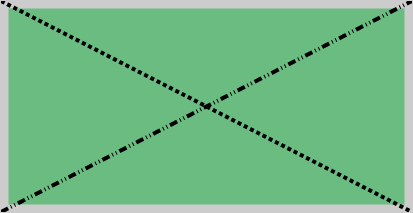

# Canvas.StrokeDashArray

Canvas.StrokeDashArray
-

# Canvas.StrokeDashArray

## Синтаксис

StrokeDashArray: Array;

## Описание

Свойство StrokeDashArray устанавливает
 способ отображения линий на канве.

## Комментарии

Значение свойства устанавливается из JSON и с помощью метода setStrokeDashArray,
 а возвращается с помощью метода getStrokeDashArray.

Метод setStrokeDashArray может
 принимать в качестве параметра строку, которая может иметь одно из следующих
 значений:

		 Значение

		 Краткое
		 описание

		 dot (dotted)

		 Устанавливает отображение пунктирных линий.

		 dash (dashed)

		 Устанавливает отображение штриховых линий.

		 shortdot

		 Устанавливает отображение пунктирных линий с маленькими точками.

		 shortdash

		 Устанавливает отображение штриховых линий с короткими штрихами.

		 shortdashdot

		 Устанавливает отображение штрих-пунктирных линий с короткими
		 штрихами.

		 dashdot

		 Устанавливает отображение штрих-пунктирных линий.

		 longdashdot

		 Устанавливает отображение штрих-пунктирных линий с длинными
		 штрихами.

		 shortdashdotdot

		 Устанавливает отображение штрих-пунктирных линий с короткими
		 штрихами и двумя точками.

		 dashdotdot

		 Устанавливает отображение штрих-пунктирных линий с двумя точками.

		 longdashdotdot

		 Устанавливает отображение штрих-пунктирных линий с длинными
		 штрихами и двумя точками.

## Пример

Для выполнения примера предполагается наличие на странице компонента
 [Canvas](../../Components/Canvas/Canvas.htm) c наименованием
 «canvas» (см. «[Пример
 создания компонента Canvas](../../Components/Canvas/Example_Canvas.htm)»). Нарисуем две линии на канве с разными
 типами:

// Устанавливаем ширину линий
canvas.setStrokeWidth(4);
// Устанавливаем стиль границы фигур
canvas.setStrokeStyle("#000000");
// Устанавливаем вид отображения границ
canvas.setStrokeDashArray("dash");
// Рисуем линию
canvas.drawLine(0, 0, 411, 211);
// Устанавливаем способ отображения линий на канве
canvas.setStrokeDashArray("longdashdotdot");
// Рисуем линию
canvas.drawLine(0, 211, 411, 0);
// Принимаем изменения канвы
canvas.flush();
В результате на канве будут отображены две линии с разными типами:

Очистим канву:

// Очищаем канву
canvas.clear();
В результате канва будет очищена.

См. также:

[Canvas](Canvas.htm)

		Справочная
		 система на версию 10.9
		 от 18/08/2025,
		 © ООО «ФОРСАЙТ»,
